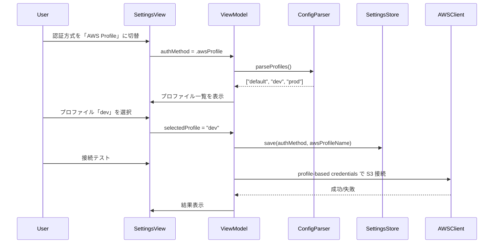

# 技術設計ドキュメント（Design Document）

## 概要（Overview）

AWS 認証方式を従来の Access Key 手動入力に加え、AWS CLI プロファイル選択方式に対応する。設定画面に認証方式 Picker を追加し、`~/.aws/config` からプロファイル一覧を読み取って選択可能にする。選択した認証方式とプロファイル名は `settings.json` に永続化する。

### 実装方針

- `AuthMethod` enum（`accessKey` / `awsProfile`）で認証方式を管理
- `AWSConfigParser` で `~/.aws/config` の INI 形式を解析し、プロファイル名一覧を抽出
- macOS: AWS SDK for Swift は直接的な profile-based credential provider を持たないため、`~/.aws/credentials` / `~/.aws/config` から認証情報（access_key / secret_key / session_token）を直接読み取る方式を採用。SSO プロファイルの場合は環境変数 `AWS_PROFILE` を設定して SDK のデフォルト credential resolver に委譲
- Windows: AWS SDK for .NET の `CredentialProfileStoreChain` を使用してプロファイルから認証情報を自動解決
- 既存の Access Key 方式は完全に維持（後方互換性）
- `settings.json` に `authMethod` / `awsProfileName` フィールドを追加（既存フィールドに影響なし）

## アーキテクチャ

```
AWSSettingsView / Settings Dialog
├── 認証方式 Picker（Access Key / AWS Profile）
├── [accessKey] Access Key ID / Secret Access Key 入力フィールド
├── [awsProfile] プロファイル Picker + リフレッシュボタン
├── リージョン Picker
├── S3 バケット名
└── 接続テスト

AWSConfigParser（共通ロジック）
├── parseProfiles(from: String) -> [String]
└── INI 形式解析（[default], [profile xxx]）

AWS SDK クライアント生成
├── [accessKey] StaticCredentials（既存）
└── [awsProfile] Profile-based credential resolution
    ├── macOS: config/credentials ファイル直接読み取り or AWS_PROFILE 環境変数
    └── Windows: CredentialProfileStoreChain
```



## コンポーネントとインターフェース（Components and Interfaces）

### 1. AuthMethod enum

認証方式を表す列挙型。両プラットフォーム共通。

```swift
// macOS (Swift)
enum AuthMethod: String, Codable, CaseIterable {
    case accessKey = "accessKey"
    case awsProfile = "awsProfile"
}
```

```csharp
// Windows (C#)
public enum AuthMethod
{
    AccessKey,
    AwsProfile
}
```

### 2. AWSConfigParser

`~/.aws/config` の INI 形式を解析してプロファイル名一覧を抽出する純粋関数モジュール。

```swift
// macOS (Swift)
struct AWSConfigParser {
    /// config ファイルの内容文字列からプロファイル名一覧を抽出する
    static func parseProfileNames(from content: String) -> [String]
    
    /// ~/.aws/config のデフォルトパスを返す
    static var defaultConfigPath: String
    
    /// ファイルパスからプロファイル名一覧を読み取る
    static func loadProfileNames(from path: String?) -> [String]
}
```

```csharp
// Windows (C#)
public static class AWSConfigParser
{
    public static List<string> ParseProfileNames(string content);
    public static string DefaultConfigPath { get; }
    public static List<string> LoadProfileNames(string? path = null);
}
```

解析ルール:
- `[default]` → プロファイル名 `"default"`
- `[profile xxx]` → プロファイル名 `"xxx"`
- `#` または `;` で始まる行はコメントとして無視
- 空行およびキーバリューペア行はスキップ
- プロファイル名の前後の空白はトリム

### 3. AWSSettingsViewModel の拡張（macOS）

```swift
// 新規プロパティ
@Published var authMethod: AuthMethod = .accessKey
@Published var selectedProfileName: String = ""
@Published var availableProfiles: [String] = []
@Published var profileLoadError: String?

// 新規メソッド
func loadProfiles()           // ~/.aws/config からプロファイル一覧を読み込む
func refreshProfiles()        // リフレッシュボタン用

// 変更: hasValidCredentials / loadAWSCredentials を authMethod に応じて分岐
```

### 4. Settings Dialog の拡張（Windows）

Windows 版は `MainPage.xaml.cs` の `OnSettingsClick` 内で設定ダイアログを構築しているため、同メソッド内に認証方式 RadioButtons とプロファイル ComboBox を追加する。

### 5. Profile-based Credential Provider

#### macOS（Swift）

AWS SDK for Swift は直接的な named profile credential provider を持たないため、以下の2段階方式を採用:

1. `~/.aws/credentials` および `~/.aws/config` から選択プロファイルの `aws_access_key_id` / `aws_secret_access_key` / `aws_session_token` を直接読み取り、`StaticAWSCredentialIdentityResolver` で SDK クライアントを生成
2. 上記キーが存在しない場合（SSO プロファイル等）、環境変数 `AWS_PROFILE` を設定し、SDK のデフォルト credential resolver（`DefaultChainResolver`）に委譲

```swift
struct AWSProfileCredentialHelper {
    /// プロファイルから認証情報を解決する
    /// 1. credentials/config ファイルから直接読み取り
    /// 2. 失敗時は AWS_PROFILE 環境変数を設定して SDK デフォルトに委譲
    static func resolveCredentials(profileName: String) throws -> (accessKey: String, secretKey: String, sessionToken: String?, region: String?)
    
    /// プロファイルの region 設定を読み取る
    static func resolveRegion(profileName: String) -> String?
}
```

#### Windows（C#）

AWS SDK for .NET の `CredentialProfileStoreChain` を使用:

```csharp
public static class AWSProfileCredentialHelper
{
    public static AWSCredentials ResolveCredentials(string profileName);
    public static string? ResolveRegion(string profileName);
}
```

### 6. AWS サービスクライアント生成の分岐

既存の各サービス（S3, Transcribe, Transcribe Streaming, Translate, Bedrock Runtime）のクライアント生成箇所を、`authMethod` に応じて分岐させる。

```swift
// macOS: 共通ヘルパー
struct AWSClientFactory {
    /// 現在の認証設定に基づいて credential resolver を生成する
    static func makeCredentialResolver() throws -> some AWSCredentialIdentityResolver
}
```

```csharp
// Windows: 共通ヘルパー
public static class AWSClientFactory
{
    public static AWSCredentials MakeCredentials(SettingsStore store);
}
```

## データモデル（Data Models）

### AppSettings の拡張

```swift
// macOS (Swift) - AppSettings に追加するフィールド
struct AppSettings: Codable, Equatable {
    // ... 既存フィールド ...
    
    /// 認証方式（"accessKey" または "awsProfile"）
    var authMethod: String = "accessKey"
    /// 選択された AWS プロファイル名
    var awsProfileName: String = ""
}
```

```csharp
// Windows (C#) - AppSettings に追加するフィールド
public class AppSettings
{
    // ... 既存フィールド ...
    
    [JsonPropertyName("authMethod")]
    public string AuthMethod { get; set; } = "accessKey";
    
    [JsonPropertyName("awsProfileName")]
    public string AwsProfileName { get; set; } = "";
}
```

### settings.json スキーマ変更

```json
{
  "accessKeyId": "...",
  "secretAccessKey": "...",
  "region": "ap-northeast-1",
  "s3BucketName": "...",
  "authMethod": "accessKey",
  "awsProfileName": "",
  "recordingDirectoryPath": "",
  "exportDirectoryPath": "",
  "isRealtimeEnabled": true,
  "bedrockModelId": "anthropic.claude-sonnet-4-6"
}
```

後方互換性: `authMethod` フィールドが存在しない既存の `settings.json` は、デフォルト値 `"accessKey"` として扱われる（`Codable` / `JsonSerializer` のデフォルト値機能で自動対応）。


## 正確性プロパティ（Correctness Properties）

*プロパティとは、システムのすべての有効な実行において真であるべき特性や振る舞いのことです。要件を機械的に検証可能な正確性保証に橋渡しする役割を果たします。*

### Property 1: AWS Config パーサーのラウンドトリップ

*For any* 有効なプロファイル名のセット（`default` を含む/含まない）に対して、そのセットから `~/.aws/config` 形式の文字列を生成し、`AWSConfigParser.parseProfileNames()` でパースした結果は、元のプロファイル名セットと同一であること。生成される config 文字列にはコメント行（`#` / `;`）、空行、キーバリューペアがランダムに挿入される。

**Validates: Requirements 2.1, 2.2, 7.1, 7.2, 7.3, 7.4**

### Property 2: 設定永続化のラウンドトリップ（authMethod / awsProfileName）

*For any* 有効な `AppSettings` オブジェクト（`authMethod` が `"accessKey"` または `"awsProfile"`、`awsProfileName` が任意の非空文字列）に対して、`AppSettingsStore.save()` で保存し `AppSettingsStore.load()` で読み込んだ結果は、元の `AppSettings` と同一であること。

**Validates: Requirements 3.1, 3.2, 3.3**

## エラーハンドリング（Error Handling）

| エラー状況 | 対応 |
|---|---|
| `~/.aws/config` が存在しない | `profileLoadError` に「AWS CLI の設定ファイルが見つかりません」を設定。プロファイル Picker を空にする |
| `~/.aws/config` にプロファイルが未定義 | `profileLoadError` に「プロファイルが見つかりません」を設定 |
| config ファイルのパースエラー | パース可能な部分のみ抽出。致命的エラーは `profileLoadError` に設定 |
| プロファイルの認証情報が無効/期限切れ | 接続テスト失敗時に「認証情報が無効です。`aws sso login --profile <profile>` を実行してください」を表示 |
| プロファイルに region が未設定 | `settings.json` のリージョン設定をフォールバックとして使用 |
| `authMethod` フィールドが settings.json に存在しない（既存ユーザー） | デフォルト値 `"accessKey"` を使用（後方互換性） |

## テスト戦略（Testing Strategy）

### プロパティベーステスト（Property-Based Testing）

本機能は純粋関数（INI パーサー、設定シリアライゼーション）を含むため、PBT が適用可能。

- ライブラリ: macOS は **SwiftCheck**（既存依存）、Windows は **FsCheck** または手動ランダムテスト
- 各プロパティテストは最低 **100 回**のイテレーションを実行
- 各テストにはデザインドキュメントのプロパティ番号をタグ付け
  - タグ形式: `Feature: aws-profile-auth, Property {number}: {property_text}`

#### Property 1: Config パーサーラウンドトリップ

ジェネレーター:
- ランダムなプロファイル名セット（1〜10個、英数字・ハイフン・アンダースコア）
- `default` プロファイルの有無をランダム
- 各プロファイルセクション間にランダムなコメント行・空行・キーバリューペアを挿入
- config 文字列を生成 → パース → 結果がソート済みの元セットと一致することを検証

#### Property 2: 設定永続化ラウンドトリップ

ジェネレーター:
- `authMethod`: `"accessKey"` または `"awsProfile"` からランダム選択
- `awsProfileName`: ランダムな文字列（空文字列を含む）
- 既存フィールド（`accessKeyId`, `region` 等）もランダム生成
- 一時ディレクトリに保存 → 読み込み → 全フィールドが一致することを検証

### ユニットテスト（Unit Tests）

- `AWSConfigParser` の具体的なケース（空ファイル、コメントのみ、default のみ、複数プロファイル）
- `AuthMethod` enum のシリアライゼーション/デシリアライゼーション
- `AWSSettingsViewModel` の `authMethod` 切り替え時の UI 状態遷移
- 後方互換性: `authMethod` フィールドなしの JSON デシリアライズでデフォルト値が使用されること
- `AWSProfileCredentialHelper` のモックテスト（credentials ファイルからの読み取り）

### 統合テスト（Integration Tests）

- 実際の `~/.aws/config` を使用したプロファイル読み取り（CI 環境ではスキップ）
- プロファイルベースの接続テスト（実 AWS 環境が必要）
