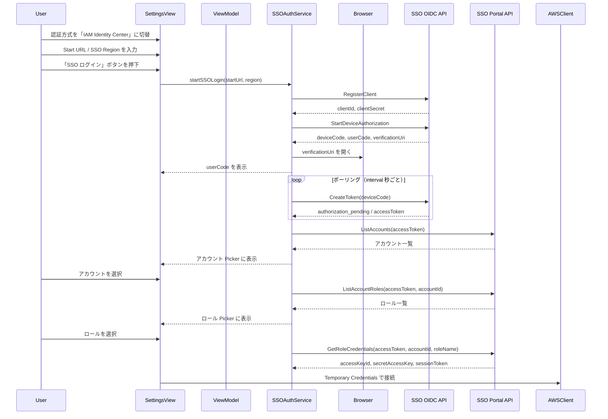

# 技術設計ドキュメント（Design Document）

## 概要（Overview）

AWS IAM Identity Center（SSO）による認証機能を追加する。OIDC Device Authorization Grant（RFC 8628）フローを使用し、ブラウザ経由でユーザー認証を行い、一時的な AWS 認証情報を取得する方式を採用する。

既存の Access Key 方式・AWS Profile 方式に加え、3つ目の認証方式として `sso` を `AuthMethod` enum に追加する。新規の `SSOAuthService` クラスが OIDC フロー全体（RegisterClient → StartDeviceAuthorization → CreateToken → ListAccounts → ListAccountRoles → GetRoleCredentials）を管理し、取得した Temporary Credentials を `AWSClientFactory` 経由で全 AWS サービスクライアントに供給する。

### 実装方針

- macOS: AWS SDK for Swift の `AWSSSOOIDC` / `AWSSSO` モジュールを使用（aws-sdk-swift v1.6.87 に含まれる）
- Windows: AWS SDK for .NET の `AWSSDK.SSOOIDC` / `AWSSDK.SSO` NuGet パッケージを使用
- SSO 設定（Start URL / SSO Region / Account ID / Role Name）は `settings.json` に永続化
- Access Token はメモリ内で保持し、有効期限管理を行う（ディスクには保存しない）
- 既存の Access Key / AWS Profile 方式は完全に維持（後方互換性）

### 調査結果

- AWS SDK for Swift（aws-sdk-swift v1.x）には `AWSSSOOIDC` および `AWSSSO` モジュールが含まれている。Package.swift の dependencies に `AWSSSOOIDC` / `AWSSSO` product を追加することで利用可能
- AWS SDK for .NET には `AWSSDK.SSOOIDC`（v3.x/4.x）および `AWSSDK.SSO`（v3.x/4.x）NuGet パッケージが存在する
- SSO OIDC API エンドポイント: `https://oidc.{ssoRegion}.amazonaws.com/`
- SSO Portal API エンドポイント: `https://portal.sso.{ssoRegion}.amazonaws.com/`
- Device Authorization Flow のポーリング間隔はデフォルト5秒、`slow_down` エラー時に5秒延長

## アーキテクチャ（Architecture）

```
AWSSettingsView / Settings Dialog
├── 認証方式 Picker（Access Key / AWS Profile / IAM Identity Center）
├── [accessKey] Access Key ID / Secret Access Key 入力フィールド
├── [awsProfile] プロファイル Picker + リフレッシュボタン
├── [sso] Start URL / SSO Region / SSO ログインボタン
│   ├── User Code 表示 + ガイダンスメッセージ
│   ├── アカウント Picker（ListAccounts 結果）
│   └── ロール Picker（ListAccountRoles 結果）
├── リージョン Picker（サービス用）
├── S3 バケット名
└── 接続テスト

SSOAuthService（新規）
├── registerClient() → clientId, clientSecret
├── startDeviceAuthorization() → deviceCode, userCode, verificationUri
├── pollForToken() → accessToken, expiresAt
├── listAccounts() → [(accountId, accountName)]
├── listAccountRoles() → [roleName]
├── getRoleCredentials() → (accessKeyId, secretAccessKey, sessionToken)
└── isTokenValid() → Bool

AWSClientFactory（拡張）
├── [accessKey] StaticCredentials（既存）
├── [awsProfile] Profile-based credential resolution（既存）
└── [sso] Temporary Credentials from SSOAuthService（新規）
```



## コンポーネントとインターフェース（Components and Interfaces）

### 1. AuthMethod enum の拡張

```swift
// macOS (Swift)
enum AuthMethod: String, Codable, CaseIterable, Identifiable {
    case accessKey = "accessKey"
    case awsProfile = "awsProfile"
    case sso = "sso"

    var id: String { rawValue }

    var displayName: String {
        switch self {
        case .accessKey: return "Access Key"
        case .awsProfile: return "AWS Profile"
        case .sso: return "IAM Identity Center"
        }
    }
}
```

```csharp
// Windows (C#)
public enum AuthMethod
{
    AccessKey,
    AwsProfile,
    Sso
}
```

### 2. SSOAuthService（新規）

OIDC Device Authorization Flow の全ステップを管理するサービスクラス。

#### macOS (Swift)

```swift
import AWSSSOOIDC
import AWSSSO

/// SSO 認証フローの状態
enum SSOLoginState: Equatable {
    case idle
    case registering
    case waitingForBrowser(userCode: String, verificationUri: String)
    case polling
    case selectingAccount
    case selectingRole
    case authenticated
    case error(String)
}

/// SSO アカウント情報
struct SSOAccountInfo: Identifiable, Equatable {
    let accountId: String
    let accountName: String
    var id: String { accountId }
    var displayName: String { "\(accountName) (\(accountId))" }
}

/// SSO で取得した一時認証情報
struct SSOTemporaryCredentials: Equatable {
    let accessKeyId: String
    let secretAccessKey: String
    let sessionToken: String
    let expiration: Date
}

@MainActor
class SSOAuthService: ObservableObject {
    @Published var loginState: SSOLoginState = .idle
    @Published var accounts: [SSOAccountInfo] = []
    @Published var roles: [String] = []
    @Published var temporaryCredentials: SSOTemporaryCredentials?

    /// メモリ内で保持する Access Token
    private var accessToken: String?
    private var accessTokenExpiry: Date?

    /// OIDC Device Authorization Flow を開始する
    func startLogin(startUrl: String, region: String) async throws

    /// アカウント一覧を取得する
    func fetchAccounts() async throws

    /// 指定アカウントのロール一覧を取得する
    func fetchRoles(accountId: String) async throws

    /// 一時認証情報を取得する
    func fetchCredentials(accountId: String, roleName: String) async throws

    /// Access Token が有効かどうか
    var isTokenValid: Bool { get }

    /// ログイン状態をリセットする
    func reset()
}
```

#### Windows (C#)

```csharp
using Amazon.SSOOIDC;
using Amazon.SSO;

public class SSOAuthService : INotifyPropertyChanged
{
    public SSOLoginState LoginState { get; set; }
    public List<SSOAccountInfo> Accounts { get; set; }
    public List<string> Roles { get; set; }
    public SSOTemporaryCredentials? TemporaryCredentials { get; set; }

    public async Task StartLoginAsync(string startUrl, string region);
    public async Task FetchAccountsAsync();
    public async Task FetchRolesAsync(string accountId);
    public async Task FetchCredentialsAsync(string accountId, string roleName);
    public bool IsTokenValid { get; }
    public void Reset();
}
```

### 3. AWSClientFactory の拡張

#### macOS (Swift)

```swift
struct AWSClientFactory {
    static func makeCredentialResolver() throws -> StaticAWSCredentialIdentityResolver? {
        // ... 既存の accessKey / awsProfile 分岐 ...

        case .sso:
            // SSOAuthService からメモリ内の Temporary Credentials を取得
            guard let creds = SSOAuthService.shared.temporaryCredentials else {
                throw AWSClientFactoryError.ssoNotAuthenticated
            }
            guard creds.expiration > Date() else {
                throw AWSClientFactoryError.ssoTokenExpired
            }
            let identity = AWSCredentialIdentity(
                accessKey: creds.accessKeyId,
                secret: creds.secretAccessKey,
                sessionToken: creds.sessionToken
            )
            return StaticAWSCredentialIdentityResolver(identity)
    }
}
```

#### Windows (C#)

```csharp
public static class AWSClientFactory
{
    public static AWSCredentials MakeCredentials(SettingsStore store)
    {
        // ... 既存の accessKey / awsProfile 分岐 ...

        case Models.AuthMethod.Sso:
            var ssoCreds = SSOAuthService.Instance.TemporaryCredentials;
            if (ssoCreds == null)
                throw new AppError(AppErrorType.CredentialsNotSet,
                    "SSO ログインを実行してください");
            return new SessionAWSCredentials(
                ssoCreds.AccessKeyId, ssoCreds.SecretAccessKey, ssoCreds.SessionToken);
    }
}
```

### 4. AWSSettingsView / Settings Dialog の拡張

SSO 方式選択時に表示する UI 要素:

- Start URL テキストフィールド
- SSO Region Picker
- 「SSO ログイン」ボタン
- User Code 表示ラベル + ガイダンスメッセージ
- プログレスインジケーター（ポーリング中）
- アカウント Picker（認証成功後に表示）
- ロール Picker（アカウント選択後に表示）
- 認証ステータス表示（「認証済み」/ 残り有効時間）

### 5. Package.swift / .csproj の依存追加

#### macOS

```swift
// Package.swift の dependencies に追加
.product(name: "AWSSSOOIDC", package: "aws-sdk-swift"),
.product(name: "AWSSSO", package: "aws-sdk-swift"),
```

#### Windows

```xml
<!-- .csproj に追加 -->
<PackageReference Include="AWSSDK.SSOOIDC" Version="4.*" />
<PackageReference Include="AWSSDK.SSO" Version="4.*" />
```

## データモデル（Data Models）

### AppSettings の拡張

```swift
// macOS (Swift) - 追加フィールド
struct AppSettings: Codable, Equatable {
    // ... 既存フィールド ...

    /// SSO Start URL
    var ssoStartUrl: String = ""
    /// SSO リージョン（Identity Center のリージョン）
    var ssoRegion: String = ""
    /// SSO で選択されたアカウント ID
    var ssoAccountId: String = ""
    /// SSO で選択されたロール名
    var ssoRoleName: String = ""
}
```

```csharp
// Windows (C#) - 追加フィールド
public class AppSettings
{
    // ... 既存フィールド ...

    [JsonPropertyName("ssoStartUrl")]
    public string SsoStartUrl { get; set; } = "";

    [JsonPropertyName("ssoRegion")]
    public string SsoRegion { get; set; } = "";

    [JsonPropertyName("ssoAccountId")]
    public string SsoAccountId { get; set; } = "";

    [JsonPropertyName("ssoRoleName")]
    public string SsoRoleName { get; set; } = "";
}
```

### settings.json スキーマ変更

```json
{
  "accessKeyId": "...",
  "secretAccessKey": "...",
  "region": "ap-northeast-1",
  "s3BucketName": "...",
  "authMethod": "sso",
  "awsProfileName": "",
  "ssoStartUrl": "https://my-org.awsapps.com/start",
  "ssoRegion": "us-east-1",
  "ssoAccountId": "123456789012",
  "ssoRoleName": "AdministratorAccess",
  "recordingDirectoryPath": "",
  "exportDirectoryPath": "",
  "isRealtimeEnabled": true,
  "bedrockModelId": "anthropic.claude-sonnet-4-6"
}
```

後方互換性: 新規フィールド（`ssoStartUrl` / `ssoRegion` / `ssoAccountId` / `ssoRoleName`）が存在しない既存の `settings.json` は、デフォルト値 `""` として扱われる。`authMethod` が `"sso"` 以外の場合、これらのフィールドは無視される。


## 正確性プロパティ（Correctness Properties）

*プロパティとは、システムのすべての有効な実行において真であるべき特性や振る舞いのことです。要件を機械的に検証可能な正確性保証に橋渡しする役割を果たします。*

### Property 1: SSO 設定永続化のラウンドトリップ

*For any* 有効な `AppSettings` オブジェクト（`authMethod` が `"sso"`、`ssoStartUrl` が任意の非空 URL 文字列、`ssoRegion` が任意のリージョン文字列、`ssoAccountId` が任意の12桁数字文字列、`ssoRoleName` が任意の非空文字列）に対して、`AppSettingsStore.save()` で保存し `AppSettingsStore.load()` で読み込んだ結果は、元の `AppSettings` の全フィールド（SSO 関連フィールドを含む）と同一であること。

**Validates: Requirements 6.1, 6.2, 6.3, 6.4**

### Property 2: SSOAccountInfo の表示名フォーマット

*For any* 非空の `accountName` 文字列と非空の `accountId` 文字列に対して、`SSOAccountInfo(accountId:accountName:).displayName` は `"{accountName} ({accountId})"` 形式の文字列を返すこと。

**Validates: Requirements 3.2**

### Property 3: トークン有効期限の判定

*For any* `accessTokenExpiry`（Date）と現在時刻に対して、`isTokenValid` は `accessTokenExpiry > 現在時刻` の場合にのみ `true` を返すこと。有効期限が過去の場合は常に `false` を返すこと。

**Validates: Requirements 5.1, 5.2**

### Property 4: AWSClientFactory の SSO credentials 変換

*For any* 有効な `SSOTemporaryCredentials`（非空の accessKeyId / secretAccessKey / sessionToken、未来の expiration）に対して、`AWSClientFactory.makeCredentialResolver()` は `StaticAWSCredentialIdentityResolver` を返し、その resolver から取得される credential identity の accessKey / secret / sessionToken が元の `SSOTemporaryCredentials` の値と一致すること。

**Validates: Requirements 4.2, 7.1**

## エラーハンドリング（Error Handling）

| エラー状況 | 対応 |
|---|---|
| Start URL が空または不正な形式 | バリデーションエラー: 「有効な Start URL を入力してください」 |
| SSO Region が未選択 | バリデーションエラー: 「SSO リージョンを選択してください」 |
| RegisterClient API 失敗 | `loginState = .error("SSO 接続に失敗しました。Start URL と SSO リージョンを確認してください")` |
| StartDeviceAuthorization API 失敗 | `loginState = .error("デバイス認証の開始に失敗しました。Start URL を確認してください")` |
| CreateToken: `authorization_pending` | ポーリング継続（正常フロー） |
| CreateToken: `slow_down` | ポーリング間隔を5秒延長して継続 |
| CreateToken: `expired_token` | `loginState = .error("認証がタイムアウトしました。再度 SSO ログインを実行してください")` |
| CreateToken: その他のエラー | `loginState = .error("認証に失敗しました: {エラー詳細}")` |
| ListAccounts が空の結果 | 「利用可能なアカウントがありません。IAM Identity Center の権限設定を確認してください」 |
| ListAccountRoles が空の結果 | 「このアカウントで利用可能なロールがありません」 |
| GetRoleCredentials 失敗 | 「一時認証情報の取得に失敗しました: {エラー詳細}」 |
| Access Token 期限切れ | 「SSO セッションが期限切れです。再度 SSO ログインを実行してください」 |
| Temporary Credentials 期限切れ（AWS API 呼び出し失敗） | 「認証情報が期限切れです。設定画面から SSO ログインを再実行してください」 |
| SSO 未認証で接続テスト実行 | 「SSO ログインを実行してください」 |
| SSO 未認証で AWS サービス利用 | `AWSClientFactoryError.ssoNotAuthenticated` をスロー |
| `ssoStartUrl` / `ssoRegion` 等が settings.json に存在しない（既存ユーザー） | デフォルト値 `""` を使用（後方互換性） |

## テスト戦略（Testing Strategy）

### プロパティベーステスト（Property-Based Testing）

本機能は純粋関数（設定シリアライゼーション、表示名フォーマット、有効期限判定、credentials 変換）を含むため、PBT が適用可能。

- ライブラリ: macOS は **SwiftCheck**（既存依存）、Windows は手動ランダムテスト
- 各プロパティテストは最低 **100 回**のイテレーションを実行
- 各テストにはデザインドキュメントのプロパティ番号をタグ付け
  - タグ形式: `Feature: identity-center-sso-auth, Property {number}: {property_text}`

#### Property 1: SSO 設定永続化ラウンドトリップ

ジェネレーター:
- `authMethod`: `"sso"` 固定（SSO フィールドのテストのため）
- `ssoStartUrl`: ランダムな URL 形式文字列（`https://` + ランダム英数字 + `.awsapps.com/start`）
- `ssoRegion`: AWS リージョン文字列からランダム選択
- `ssoAccountId`: 12桁のランダム数字文字列
- `ssoRoleName`: ランダムな英数字文字列
- 既存フィールド（`accessKeyId`, `region` 等）もランダム生成
- 一時ディレクトリに保存 → 読み込み → 全フィールドが一致することを検証

#### Property 2: SSOAccountInfo displayName フォーマット

ジェネレーター:
- `accountName`: ランダムな非空文字列（英数字・スペース・ハイフン）
- `accountId`: ランダムな非空文字列（12桁数字）
- `displayName` が `"{accountName} ({accountId})"` と一致することを検証

#### Property 3: トークン有効期限判定

ジェネレーター:
- `expiresAt`: 現在時刻の前後にランダムなオフセット（-3600秒〜+3600秒）を加えた Date
- `isTokenValid` が `expiresAt > Date()` と一致することを検証

#### Property 4: AWSClientFactory SSO credentials 変換

ジェネレーター:
- `accessKeyId`: ランダムな英数字文字列（20文字）
- `secretAccessKey`: ランダムな英数字文字列（40文字）
- `sessionToken`: ランダムな英数字文字列（100文字）
- `expiration`: 未来の Date
- `makeCredentialResolver()` が返す resolver の identity が元の値と一致することを検証

### ユニットテスト（Unit Tests）

- `AuthMethod` enum に `.sso` ケースが存在し、`displayName` が正しいこと
- `AuthMethod` enum のシリアライゼーション/デシリアライゼーション（`"sso"` ↔ `.sso`）
- `SSOAuthService` の状態遷移（`idle` → `registering` → `waitingForBrowser` → `polling` → `selectingAccount` → `selectingRole` → `authenticated`）
- `SSOAuthService.reset()` で状態が `idle` に戻ること
- `AWSClientFactory` の `sso` 分岐: SSO 未認証時に `ssoNotAuthenticated` エラーがスローされること
- `AWSClientFactory` の `sso` 分岐: credentials 期限切れ時に `ssoTokenExpired` エラーがスローされること
- `AWSClientFactory.currentRegion()` が `sso` 方式の場合に `settings.region` を返すこと
- 後方互換性: `ssoStartUrl` 等のフィールドなしの JSON デシリアライズでデフォルト値 `""` が使用されること
- `slow_down` エラー時のポーリング間隔延長ロジック
- 空のアカウント一覧 / ロール一覧時のエラーメッセージ設定

### 統合テスト（Integration Tests）

- 実際の SSO OIDC API を使用した Device Authorization Flow（手動テスト、CI ではスキップ）
- SSO credentials を使用した S3 接続テスト（実 AWS 環境が必要）
- 両プラットフォームでの settings.json スキーマ互換性確認
