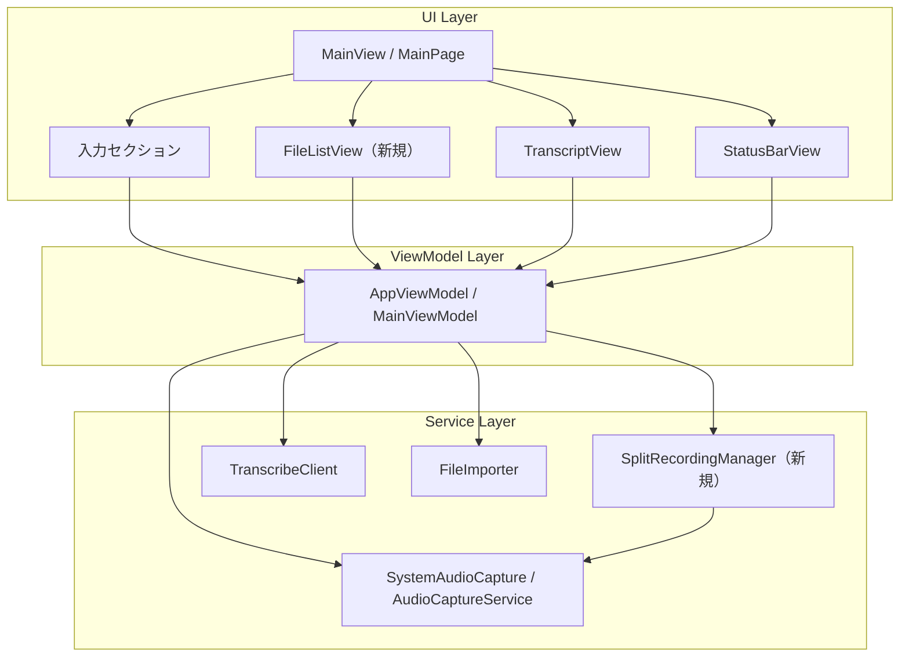
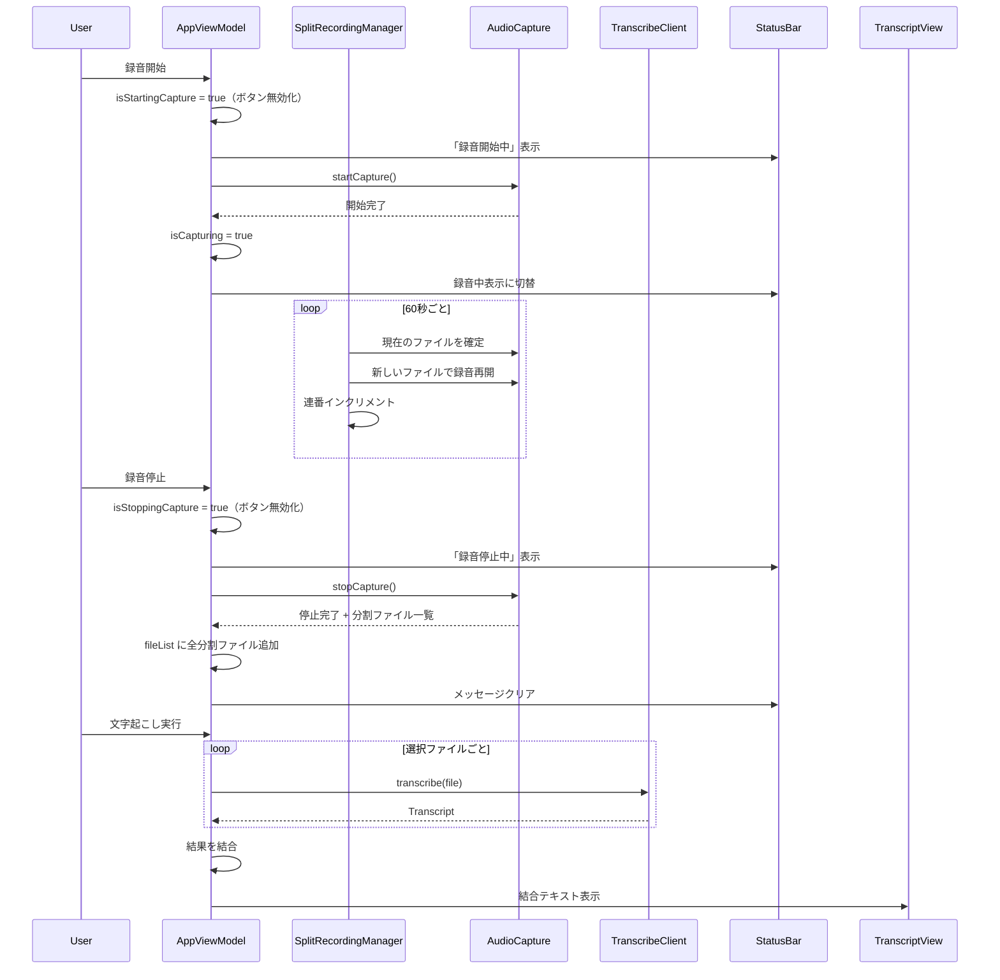

# 技術設計ドキュメント（Design Document）

## 概要（Overview）

録音ファイルの1分分割、複数ファイル対応の音声文字起こし、録音操作中のボタン無効化・ステータスバーメッセージ表示、および入力グループの不要ラベル削除の技術設計。

### 実装方針

- 録音分割は `SplitRecordingManager` として独立コンポーネント化し、既存の `SystemAudioCapture`（macOS）/ `AudioCaptureService`（Windows）から呼び出す
- 分割ファイルは1分（60秒）ごとに確定し、ファイル名末尾に `-001`, `-002`, ... の3桁連番を付与
- 音声文字起こしセクションに `File_List`（ファイルリスト UI）を新設し、複数ファイルの選択・管理を行う
- 複数ファイルの文字起こしは選択順に逐次実行し、結果をファイル順に結合
- 録音開始/停止時のボタン無効化は ViewModel の状態フラグで制御
- macOS（SwiftUI）と Windows（WinUI 3）で同一ロジック・同一 UI パターンを適用

## アーキテクチャ（Architecture）



### 処理フロー



## コンポーネントとインターフェース（Components and Interfaces）

### 1. SplitRecordingManager（新規）

録音ファイルの1分分割を管理するコンポーネント。


#### macOS（Swift）

```swift
/// 録音ファイルの1分分割を管理するクラス
final class SplitRecordingManager {
    /// 分割間隔（秒）。デフォルト60秒
    let splitInterval: TimeInterval = 60

    /// 現在の連番（1始まり）
    private(set) var currentIndex: Int = 0

    /// 生成された分割ファイルの URL 一覧
    private(set) var splitFiles: [URL] = []

    /// ベースファイル名（タイムスタンプ部分。例: "20250101_120000"）
    private let baseName: String

    /// 保存先ディレクトリ
    private let outputDirectory: URL

    /// 分割タイマー
    private var splitTimer: Timer?

    /// 3桁連番付きファイル名を生成する
    /// - Parameter index: 連番（1始まり）
    /// - Returns: ファイル名（例: "20250101_120000-001.m4a"）
    func generateFileName(index: Int) -> String

    /// 録音分割を開始する（タイマー起動）
    /// - Parameter onSplit: 分割時に呼ばれるコールバック（現在のファイルURL, 次のファイルURL）
    func startSplitting(onSplit: @escaping (URL, URL) -> Void)

    /// 録音分割を停止し、最後のファイルを確定する
    /// - Returns: 全分割ファイルの URL 一覧
    func stopSplitting() -> [URL]

    /// 連番をリセットする
    func reset()
}
```

#### Windows（C#）

```csharp
/// 録音ファイルの1分分割を管理するクラス
public class SplitRecordingManager
{
    public TimeSpan SplitInterval { get; } = TimeSpan.FromSeconds(60);
    public int CurrentIndex { get; private set; }
    public List<string> SplitFiles { get; } = new();

    /// 3桁連番付きファイル名を生成する
    public string GenerateFileName(int index);

    /// 録音分割を開始する（タイマー起動）
    public void StartSplitting(Action<string, string> onSplit);

    /// 録音分割を停止し、最後のファイルを確定する
    public List<string> StopSplitting();

    /// 連番をリセットする
    public void Reset();
}
```

### 2. AppViewModel / MainViewModel の変更

#### 新規プロパティ

```swift
// macOS
@Published var fileList: [AudioFile] = []           // ファイルリスト
@Published var fileSelections: Set<UUID> = []        // 選択状態（AudioFile.id）
@Published var isStartingCapture: Bool = false       // 録音開始中フラグ
@Published var isStoppingCapture: Bool = false       // 録音停止中フラグ
```

```csharp
// Windows
[ObservableProperty] private List<AudioFile> _fileList = new();
[ObservableProperty] private HashSet<Guid> _fileSelections = new();
[ObservableProperty] private bool _isStartingCapture;
[ObservableProperty] private bool _isStoppingCapture;
```

#### 新規メソッド

```swift
// macOS
/// 複数ファイルの文字起こしを実行し、結果を結合する
func transcribeMultipleFiles(language: TranscriptionLanguage) async

/// ファイルリストにファイルを追加する
func addFilesToList(_ urls: [URL]) async

/// ファイルリストの全選択/全解除
func toggleSelectAll()

/// ファイルリストからファイルを削除する
func removeFilesFromList(_ ids: Set<UUID>)
```

#### ステータスメッセージの変更

```swift
// macOS - statusMessage の拡張
var statusMessage: String? {
    if isStartingCapture { return "録音開始中..." }
    if isStoppingCapture { return "録音停止中..." }
    // ... 既存のロジック
}
```

```csharp
// Windows - ProgressMessage の更新
// 録音開始時: ProgressMessage = "録音開始中..."
// 録音停止時: ProgressMessage = "録音停止中..."
```

### 3. FileListView（新規 UI コンポーネント）

音声文字起こしセクション内のファイルリスト表示。

#### macOS（SwiftUI）

```swift
struct FileListView: View {
    @Binding var fileList: [AudioFile]
    @Binding var selections: Set<UUID>
    var onAddFiles: () -> Void
    var onRemoveFiles: (Set<UUID>) -> Void
    var onToggleSelectAll: () -> Void

    // 各行: チェックボックス + ファイル名 + 再生時間 + ファイルサイズ
    // ヘッダー: 全選択チェックボックス + 「ファイルを追加」ボタン
}
```

#### Windows（WinUI 3 / XAML）

```xml
<!-- FileList を TranscriptSection 内に配置 -->
<ListView x:Name="FileListView" SelectionMode="Multiple">
    <ListView.ItemTemplate>
        <DataTemplate>
            <StackPanel Orientation="Horizontal" Spacing="8">
                <CheckBox IsChecked="{Binding IsSelected}" />
                <TextBlock Text="{Binding FileName}" />
                <TextBlock Text="{Binding DurationText}" />
                <TextBlock Text="{Binding FileSizeText}" />
            </StackPanel>
        </DataTemplate>
    </ListView.ItemTemplate>
</ListView>
```

### 4. 入力セクションの変更

#### 削除対象

- macOS `MainView`: `inputArea` 内の `statusContent` クロージャから「録音中」「録画中」テキストラベルと赤い丸インジケーターを削除
- Windows `MainPage.xaml`: 入力セクション内の録音中/録画中ラベル（存在する場合）を削除

#### 追加対象

- ステータスバーの録音時間表示は維持（既存の `StatusBarView` / `StatusBar` Grid）

### 5. 既存コンポーネントの変更

#### SystemAudioCapture（macOS）

- `stopCapture()` の戻り値を `AudioFile` から `[AudioFile]`（分割ファイル配列）に変更
- `SplitRecordingManager` を内部で使用し、60秒ごとに AVAssetWriter を切り替え

#### AudioCaptureService（Windows）

- `StopCapture()` の戻り値を `string` から `List<string>`（分割ファイルパス配列）に変更
- `SplitRecordingManager` を内部で使用し、60秒ごとに WaveFileWriter を切り替え

#### FileDropZone（macOS）/ DropZone（Windows）

- 複数ファイルのドラッグ＆ドロップに対応
- `fileImporter` の `allowsMultipleSelection` を `true` に変更

## データモデル（Data Models）

### 既存モデルの変更

変更なし。`AudioFile`, `Transcript`, `Summary` は既存のまま使用する。

### 新規モデル

#### FileListItem（UI 表示用ラッパー）

```swift
// macOS
struct FileListItem: Identifiable {
    let id: UUID
    let audioFile: AudioFile
    var isSelected: Bool

    var durationText: String  // "01:00" 形式
    var fileSizeText: String  // "1.2 MB" 形式
}
```

```csharp
// Windows
public partial class FileListItem : ObservableObject
{
    public Guid Id { get; init; }
    public AudioFile AudioFile { get; init; }
    [ObservableProperty] private bool _isSelected;

    public string DurationText => ...;
    public string FileSizeText => ...;
}
```

### 分割ファイル命名規則

| 項目 | 値 |
|------|-----|
| ベース名 | `yyyyMMdd_HHmmss`（録音開始時刻） |
| 連番区切り | `-`（ハイフン） |
| 連番桁数 | 3桁ゼロ埋め（001〜999） |
| 拡張子 | macOS: `.m4a` / Windows: `.wav` |
| 例 | `20250101_120000-001.m4a`, `20250101_120000-002.m4a` |


## 正確性プロパティ（Correctness Properties）

*プロパティとは、システムのすべての有効な実行において成立すべき特性や振る舞いのことです。人間が読める仕様と機械的に検証可能な正確性保証の橋渡しとなります。*

### Property 1: 分割ファイル名の生成正確性

*任意の*ベース名（タイムスタンプ文字列）と連番（1〜999）に対して、`generateFileName` が生成するファイル名は `{ベース名}-{3桁ゼロ埋め連番}.{拡張子}` の形式であり、連番部分は常に3文字で先頭がゼロ埋めされていること。

**Validates: Requirements 4.2, 4.3, 4.4**

### Property 2: 分割ファイルの連番順追加

*任意の*分割ファイル配列（1〜N個）に対して、録音停止後に `fileList` に追加されるファイルの順序は、連番の昇順（001, 002, ..., N）と一致すること。

**Validates: Requirements 5.1**

### Property 3: ファイル追加時の全選択初期化

*任意の*数のファイル（1〜N個）を `fileList` に追加した場合、追加された全ファイルの `isSelected` が `true` であること。

**Validates: Requirements 5.3**

### Property 4: 手動追加ファイルの末尾追加

*任意の*既存ファイルリスト（0〜M個）に対して、手動で追加されたファイル（1〜K個）は既存リストの末尾に追加され、既存ファイルの順序は変更されないこと。

**Validates: Requirements 5.4**

### Property 5: 全選択/全解除トグル

*任意の*ファイルリスト（1〜N個）と任意の選択状態に対して、全選択トグルを実行すると、全ファイルが未選択の場合は全選択に、1つ以上選択されている場合は全解除になること。

**Validates: Requirements 6.2**

### Property 6: 文字起こし結果の順序結合

*任意の*文字起こし結果テキスト配列（1〜N個）に対して、結合結果は配列の順序通りにテキストが連結されており、各テキストの内容が欠落・変更されていないこと。

**Validates: Requirements 7.1, 7.3**

### Property 7: 複数ファイル文字起こしの全体進捗計算

*任意の*ファイル数 N（1〜100）と現在処理中のファイルインデックス i（0〜N-1）および個別進捗 p（0.0〜1.0）に対して、全体進捗は `(i + p) / N` で計算され、値は常に 0.0〜1.0 の範囲内であること。

**Validates: Requirements 7.2**

### Property 8: エラー時の文字起こし継続

*任意の*ファイルリスト（2〜N個）において、任意の位置のファイルで文字起こしエラーが発生した場合、エラーが発生したファイルをスキップし、残りのファイルの文字起こしが継続されること。最終結果にはエラーファイルを除く全ファイルの結果が含まれること。

**Validates: Requirements 7.6**

## エラーハンドリング（Error Handling）

### 録音開始/停止エラー

| エラー状況 | 対応 |
|-----------|------|
| 録音開始失敗（権限不足、デバイスエラー） | `isStartingCapture = false` に戻し、`errorMessage` にエラー内容を設定 |
| 録音停止失敗 | `isStoppingCapture = false` に戻し、`errorMessage` にエラー内容を設定 |
| 分割ファイル書き込み失敗 | 録音を継続し、次の分割で再試行。エラーログに記録 |

### 文字起こしエラー

| エラー状況 | 対応 |
|-----------|------|
| 個別ファイルの文字起こし失敗 | エラーメッセージにファイル名とエラー内容を追記し、残りのファイルを継続処理 |
| 全ファイルの文字起こし失敗 | `errorMessage` に全エラーを表示。`transcript` は `nil` のまま |
| 無音ファイル（silentAudio） | 該当ファイルをスキップし、エラーメッセージに記録。残りを継続 |

### ファイルリストエラー

| エラー状況 | 対応 |
|-----------|------|
| サポート対象外のファイル形式 | `errorMessage` に対応形式を表示。リストには追加しない |
| 破損ファイル | `errorMessage` にエラーを表示。リストには追加しない |
| ファイルアクセス権限なし | `errorMessage` にエラーを表示。リストには追加しない |

## テスト戦略（Testing Strategy）

### テストアプローチ

- **プロパティベーステスト（PBT）**: ファイル名生成、リスト操作、結果結合、進捗計算などの純粋ロジックに適用
- **ユニットテスト**: ViewModel の状態遷移、エラーハンドリング、UI 状態の具体的なシナリオに適用
- **インテグレーションテスト**: 実際の録音分割、ファイル I/O、Amazon Transcribe との連携に適用

### PBT ライブラリ

- macOS（Swift）: [SwiftCheck](https://github.com/typelift/SwiftCheck) または Swift Testing の組み込みパラメタライズドテスト
- Windows（C#）: [FsCheck](https://fscheck.github.io/FsCheck/) with xUnit

### PBT 設定

- 各プロパティテストは最低100回のイテレーションを実行
- 各テストにはデザインドキュメントのプロパティ番号をタグとしてコメントに記載
- タグ形式: `Feature: recording-split-multi-transcribe, Property {number}: {property_text}`

### ユニットテスト対象

- 録音開始/停止時のボタン状態遷移（要件 2.1〜2.5, 3.1〜3.5）
- ステータスメッセージの表示/クリア（要件 2.2, 2.4, 3.2, 3.4）
- 入力セクションのラベル削除確認（要件 1.1〜1.3）
- FileListItem の表示プロパティ（要件 5.2）
- ファイル選択ダイアログの複数選択設定（要件 6.3, 6.4）

### インテグレーションテスト対象

- 実際の録音分割動作（60秒タイマー）（要件 4.1）
- 分割ファイルの有効性確認（要件 4.6）
- 文字起こし結果の .transcript.txt 保存（要件 7.5）
