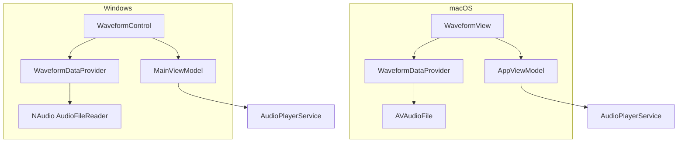

# 設計書（Design Document）

## 概要（Overview）

本設計書は、音声文字起こし＋要約アプリケーション（macOS SwiftUI / Windows WinUI 3）のUI改善に関する技術設計を記述する。

主な変更点:
1. **FileListView の「追加」ボタン削除** — Windows版のファイルリストヘッダーから「追加」ボタンを削除（macOS版は実装済み）
2. **波形表示（Waveform Display）** — 既存の Slider + AudioSpectrumView を波形表示に置き換え。AVAudioFile / NAudio からサンプルデータを読み取り、再生済み/未再生部分を色分けして描画
3. **処理中のGUI操作無効化** — 文字起こし＋要約、ファイルから要約、要約の各処理中にGUI操作を無効化する `isProcessing` 計算プロパティの導入

## アーキテクチャ（Architecture）

### 全体構成

既存の MVVM アーキテクチャを維持し、各プラットフォーム固有のView層に変更を加える。



### 変更方針

- **View層のみの変更を優先**: ViewModel / Service 層への変更は最小限に抑える
- **外部ライブラリ不使用**: 波形描画は SwiftUI Canvas/Path（macOS）、XAML Canvas/Polyline（Windows）で実装
- **波形データの事前計算**: 音声ファイル読み込み時にサンプルデータをダウンサンプリングし、描画用の配列として保持

## コンポーネントとインターフェース（Components and Interfaces）

### 1. WaveformDataProvider（波形データ提供）

音声ファイルからサンプルデータを読み取り、描画用にダウンサンプリングする共通ロジック。

#### macOS（Swift）

```swift
/// 波形描画用のサンプルデータを提供する
struct WaveformDataProvider {
    /// 音声ファイルから波形データを抽出する
    /// - Parameters:
    ///   - url: 音声ファイルの URL
    ///   - sampleCount: 出力するサンプル数（描画解像度）
    /// - Returns: 正規化された振幅値の配列（0.0〜1.0）
    static func loadWaveformData(from url: URL, sampleCount: Int = 200) -> [Float]
}
```

実装方針:
- `AVAudioFile` でファイルを開き、`AVAudioPCMBuffer` にサンプルを読み込む
- 全サンプルを `sampleCount` 個のビンに分割し、各ビンの最大振幅を取得
- 結果を 0.0〜1.0 に正規化して返す

#### Windows（C#）

```csharp
/// <summary>波形描画用のサンプルデータを提供する</summary>
public static class WaveformDataProvider
{
    /// <summary>音声ファイルから波形データを抽出する</summary>
    public static float[] LoadWaveformData(string filePath, int sampleCount = 200);
}
```

実装方針:
- `NAudio.Wave.AudioFileReader` でファイルを開き、サンプルを読み込む
- 全サンプルを `sampleCount` 個のビンに分割し、各ビンの最大振幅を取得
- 結果を 0.0〜1.0 に正規化して返す

### 2. WaveformView（macOS SwiftUI）

既存の `AudioPlayerView` 内の Slider と `AudioSpectrumView` を置き換える波形表示ビュー。

```swift
/// 波形表示ビュー
/// Canvas を使用して波形を描画し、再生位置をクリック/ドラッグで操作可能にする
struct WaveformView: View {
    let waveformData: [Float]       // 波形データ（0.0〜1.0）
    let duration: TimeInterval       // 音声の総再生時間
    let currentTime: TimeInterval    // 現在の再生位置
    let onSeek: (TimeInterval) -> Void  // シーク操作コールバック
}
```

描画方針:
- SwiftUI `Canvas` を使用して波形バーを描画
- 再生済み部分: `Color.blue`（アクセントカラー）
- 未再生部分: `Color.gray.opacity(0.4)`
- 各バーは幅2pt、間隔1ptの縦棒として描画
- `DragGesture` でシーク操作を実装

### 3. WaveformControl（Windows WinUI 3）

既存の `PositionSlider` と `SpectrumPanel` を置き換える波形表示コントロール。

```csharp
/// <summary>波形表示コントロール（XAML Canvas ベース）</summary>
// MainPage.xaml 内に Canvas 要素を配置し、コードビハインドで描画
```

描画方針:
- XAML `Canvas` 上に `Rectangle` 要素を配置して波形バーを描画
- 再生済み部分: `#0078D4`（Windows アクセントカラー）
- 未再生部分: `#C0C0C0`（グレー）
- `PointerPressed` / `PointerMoved` イベントでシーク操作を実装

### 4. isProcessing 計算プロパティ

#### macOS（AppViewModel）

```swift
/// 処理中かどうか（文字起こし、要約、ファイルから要約のいずれか）
var isProcessing: Bool {
    isTranscribing || isSummarizing
}
```

既存の `isTranscribing` と `isSummarizing` を組み合わせた計算プロパティ。
`TranscriptView` 内の既存 `isProcessing` ローカル変数と同じロジックだが、ViewModel レベルに昇格させることで全ビューから参照可能にする。

#### Windows（MainViewModel）

```csharp
/// <summary>処理中かどうか</summary>
public bool IsProcessing => IsTranscribing || IsSummarizing;
```

### 5. GUI無効化の適用範囲

処理中（`isProcessing == true`）に無効化する対象:

| UI要素 | macOS | Windows |
|--------|-------|---------|
| ツールバー録音ボタン | `.disabled(isProcessing)` | `RecordButton.IsEnabled = !isProcessing` |
| ツールバー設定ボタン | `.disabled(isProcessing)` | `SettingsButton.IsEnabled = !isProcessing` |
| 音源 Picker | `.disabled(isProcessing)` | `AudioSourcePicker.IsEnabled = !isProcessing` |
| ファイルドロップゾーン | `isDisabled: isProcessing` | `DropZone.AllowDrop = !isProcessing` |
| ファイル追加ボタン | `.disabled(isProcessing)` | `FilePickButton.IsEnabled = !isProcessing` |
| ファイルリスト | `.disabled(isProcessing)` | `FileListPanel.IsEnabled = !isProcessing` |
| 言語 Picker | `.disabled(isProcessing)` | `TranscriptionLangCombo.IsEnabled = !isProcessing` |
| Bedrock モデル Picker | `.disabled(isProcessing)` | `BedrockModelCombo.IsEnabled = !isProcessing` |
| 要約ボタン群 | `.disabled(isProcessing)` | `SummaryFileBtn.IsEnabled = !isProcessing` |
| リアルタイムトグル | `.disabled(isProcessing)` | `RealtimeToggle.IsEnabled = !isProcessing` |

無効化時の視覚的フィードバック:
- macOS: `.opacity(isProcessing ? 0.5 : 1.0)` を各セクションに適用
- Windows: `IsEnabled = false` により自動的にグレーアウト表示

**例外（無効化しない要素）:**
- ステータスバー
- セクション折りたたみ/展開トグル
- コピーボタン（結果テキストが存在する場合）


## データモデル（Data Models）

### 波形データ

波形データは音声ファイル読み込み時に一度だけ計算し、View にバインドする。

```swift
// macOS: AppViewModel に追加
@Published var waveformData: [Float] = []
```

```csharp
// Windows: MainViewModel に追加
[ObservableProperty] private float[] _waveformData = Array.Empty<float>();
```

波形データの生成タイミング:
- `importFile()` / `ImportFileAsync()` でファイル読み込み成功後
- `selectFileForPlayback()` / `SelectFileForPlayback()` でファイル切り替え時
- `stopSystemAudioCapture()` / `StopCapture()` で録音停止後

### 既存モデルへの変更

既存の `AudioFile`、`Transcript`、`Summary`、`FileListItem` モデルへの変更は不要。
波形データは ViewModel レベルで管理し、モデル層には影響を与えない。


## 正当性プロパティ（Correctness Properties）

*プロパティとは、システムのすべての有効な実行において真であるべき特性や振る舞いのことである。プロパティは、人間が読める仕様と機械で検証可能な正当性保証の橋渡しとなる。*

### Property 1: 波形ダウンサンプリングの不変条件（Waveform Downsampling Invariant）

*任意の* 非空の音声サンプル配列と任意の正の目標サンプル数 `sampleCount` に対して、ダウンサンプリング関数は正確に `sampleCount` 個の要素を持つ配列を返し、各要素は [0.0, 1.0] の範囲内であること。

**Validates: Requirements 2.1**

### Property 2: 再生位置の視覚的分割（Playback Position Visual Split）

*任意の* 正の duration と [0, duration] 内の任意の currentTime に対して、波形の再生済みバーの割合は `currentTime / duration` に等しいこと（バーの離散化による ±1 バーの誤差を許容）。

**Validates: Requirements 2.3**

### Property 3: クリック/ドラッグ位置から時間へのマッピング（Position-to-Time Mapping）

*任意の* 正の width、正の duration、[0, width] 内の任意の x 座標に対して、シーク時間は `(x / width) * duration` に等しく、結果は [0, duration] にクランプされること。

**Validates: Requirements 2.4, 2.5**

### Property 4: 時間フォーマットの正当性（Time Formatting Correctness）

*任意の* 非負の TimeInterval に対して、フォーマット関数は `MM:SS` 形式の文字列を返し、MM は `totalSeconds / 60`、SS は `totalSeconds % 60` に等しいこと。

**Validates: Requirements 2.7**

### Property 5: isProcessing 計算プロパティの正当性（isProcessing Computation）

*任意の* `isTranscribing` と `isSummarizing` のブール値の組み合わせに対して、`isProcessing` は `isTranscribing || isSummarizing` に等しいこと。

**Validates: Requirements 4.1, 5.1, 6.1**

## エラーハンドリング（Error Handling）

### 波形データ読み込みエラー

| エラー状況 | 対応 |
|-----------|------|
| 音声ファイルが存在しない | 空の波形データ `[]` を返し、波形表示を非表示にする |
| 音声ファイルが破損している | 空の波形データ `[]` を返し、既存のエラーハンドリングに委譲 |
| サンプルデータが空（0秒の音声） | 空の波形データ `[]` を返す |

### GUI無効化のエラー

| エラー状況 | 対応 |
|-----------|------|
| 処理中にアプリがクラッシュ | `finally` ブロックで `isTranscribing` / `isSummarizing` を `false` にリセット（既存実装で対応済み） |
| 処理中にファイルが削除される | 既存のエラーハンドリングで `errorMessage` を設定し、処理フラグをリセット |

## テスト戦略（Testing Strategy）

### テストアプローチ

**ユニットテスト（Example-based）:**
- FileListView ヘッダーに「追加」ボタンが含まれないことの検証
- 波形データが空の場合の WaveformView の表示確認
- isProcessing の各状態での GUI 無効化の検証
- AudioSpectrumView の参照が削除されていることの確認

**プロパティベーステスト（Property-based）:**
- ライブラリ: macOS は SwiftCheck または swift-testing のパラメタライズドテスト、Windows は FsCheck.Xunit
- 各プロパティテストは最低100回のイテレーションを実行
- 各テストにはコメントで設計書のプロパティ番号を参照
- タグ形式: `Feature: waveform-player-ui-improvements, Property {number}: {property_text}`

**テスト対象の優先順位:**
1. `WaveformDataProvider` のダウンサンプリングロジック（Property 1）
2. 位置→時間マッピング計算（Property 3）
3. 時間フォーマット関数（Property 4）
4. `isProcessing` 計算プロパティ（Property 5）
5. 再生位置の視覚的分割計算（Property 2）

**統合テスト:**
- 音声ファイル読み込み→波形表示→再生→シークの一連のフロー
- 処理中のGUI無効化→処理完了→GUI有効化の一連のフロー

