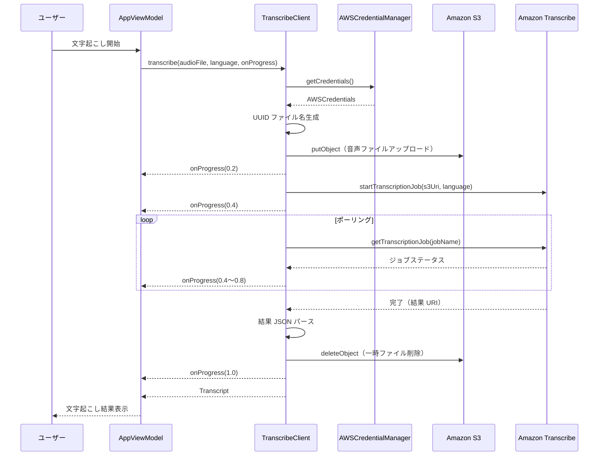
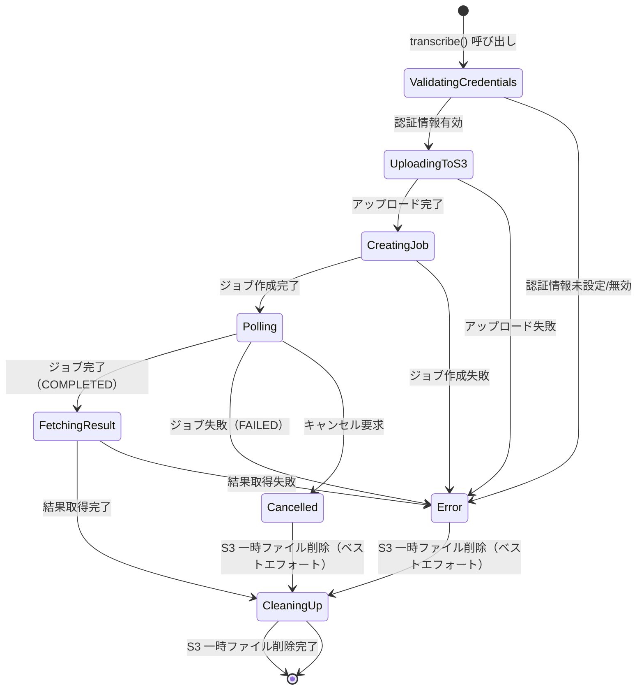
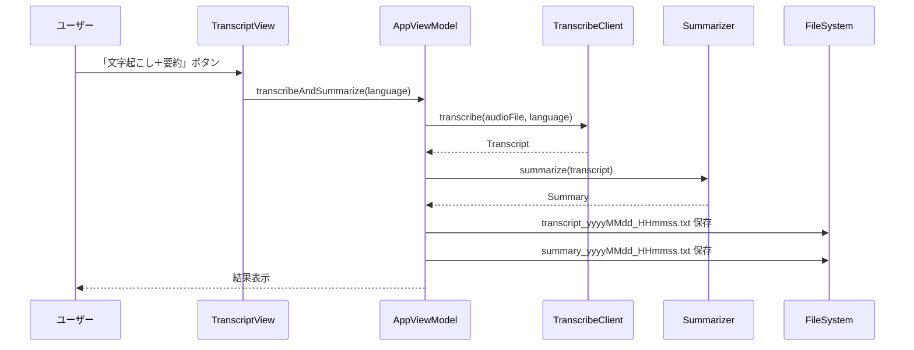

# 技術設計ドキュメント（Design Document）

## 概要（Overview）

本ドキュメントは、既存の macOS 音声文字起こし・要約アプリケーションにおいて、文字起こしエンジンを Apple SFSpeechRecognizer から Amazon Transcribe に置き換えるための技術設計を定義する。

既存の `Transcribing` プロトコルに準拠する新しい `TranscribeClient` クラスを実装し、AppViewModel への依存性注入（DI）を通じて既存機能（要約、エクスポート、再生）に影響を与えずに統合する。全設定は JSON ファイル（`~/Library/Application Support/AudioTranscriptionSummary/settings.json`）に保存し、音声ファイルは S3 経由で Amazon Transcribe に渡す。メイン画面は左右分割の1画面構成とし、設定画面のみシート（モーダル）で表示する。

### 主要な技術選定と根拠

| 技術 | 選定理由 |
|------|----------|
| AWS SDK for Swift（AWSTranscribe, AWSS3） | Amazon Transcribe / S3 の公式 Swift SDK。async/await 対応 |
| JSON ファイル（AppSettingsStore） | 全設定の永続化。手動編集・バックアップが容易 |
| Swift Concurrency（async/await） | 既存アーキテクチャと一貫した非同期処理モデル |
| UUID ベースのファイル名 | S3 アップロード時のファイル名衝突防止 |
| HSplitView / VSplitView | 1画面レイアウト。画面遷移なしで全機能を操作可能 |

## アーキテクチャ（Architecture）

既存の MVVM アーキテクチャを維持し、Service Layer に新しいコンポーネントを追加する。`TranscribeClient` は既存の `Transcribing` プロトコルに準拠するため、ViewModel 層以上の変更は最小限となる。

```mermaid
graph TB
    subgraph 新規追加コンポーネント
        AppSettingsStore[AppSettingsStore<br/>JSON ファイル永続化]
        TranscribeClient[TranscribeClient]
        AWSSettingsView[AWSSettingsView<br/>設定画面（シート）]
        StatusBarView[StatusBarView<br/>CPU・メモリ使用状況]
    end

    subgraph 既存コンポーネント（変更あり）
        AppViewModel[AppViewModel]
        SystemAudioCapture[SystemAudioCapture<br/>保存先設定参照]
        ScreenRecorder[ScreenRecorder<br/>保存先設定参照]
        MainView[MainView<br/>1画面レイアウト]
    end

    subgraph 既存コンポーネント（変更なし）
        Transcriber[Transcriber - SFSpeechRecognizer]
    end

    subgraph AWS サービス
        S3[Amazon S3]
        Transcribe[Amazon Transcribe]
    end

    subgraph ローカルストレージ
        JSONFile[(settings.json<br/>全設定を JSON で保存)]
    end

    AWSSettingsView -->|設定入力| AppSettingsStore
    AppSettingsStore -->|読み書き| JSONFile
    
    AppViewModel -->|Transcribing プロトコル| TranscribeClient
    TranscribeClient -->|認証情報取得| AppSettingsStore
    TranscribeClient -->|音声アップロード| S3
    TranscribeClient -->|ジョブ作成・結果取得| Transcribe
    S3 -->|ファイル URI| Transcribe

    SystemAudioCapture -->|保存先参照| AppSettingsStore
    ScreenRecorder -->|保存先参照| AppSettingsStore
```

### 処理フロー（文字起こし）




## コンポーネントとインターフェース（Components and Interfaces）

### AWSCredentialManager

AWS 認証情報の安全な保存・読み込み・削除を担当するサービス。macOS Keychain（Security フレームワーク）を使用する。

```swift
/// AWS 認証情報を保持する構造体
struct AWSCredentials: Equatable, Sendable {
    let accessKeyId: String
    let secretAccessKey: String
    let region: String
}

/// AWS 認証情報の管理プロトコル
protocol AWSCredentialManaging: Sendable {
    /// Keychain から認証情報を読み込む
    /// - Returns: 保存済みの認証情報。未設定の場合は nil
    func loadCredentials() -> AWSCredentials?

    /// 認証情報を Keychain に保存する
    /// - Parameter credentials: 保存する認証情報
    /// - Throws: Keychain 操作に失敗した場合
    func saveCredentials(_ credentials: AWSCredentials) throws

    /// Keychain から認証情報を削除する
    /// - Throws: Keychain 操作に失敗した場合
    func deleteCredentials() throws

    /// 認証情報が設定済みかどうか
    var hasCredentials: Bool { get }
}
```

**Keychain 保存方式**:
- サービス名: `com.app.AudioTranscriptionSummary.aws`
- 各フィールド（accessKeyId, secretAccessKey, region）を個別の Keychain アイテムとして保存
- `kSecClassGenericPassword` を使用し、`kSecAttrAccount` でフィールドを区別

### TranscribeClient

Amazon Transcribe を使用した文字起こしサービス。既存の `Transcribing` プロトコルに準拠する。

```swift
/// Amazon Transcribe を使用した文字起こしクライアント
final class TranscribeClient: Transcribing, @unchecked Sendable {
    private let credentialManager: any AWSCredentialManaging
    private let s3BucketName: String
    
    /// 初期化
    /// - Parameters:
    ///   - credentialManager: AWS 認証情報マネージャー
    ///   - s3BucketName: 音声ファイルアップロード先の S3 バケット名
    init(credentialManager: any AWSCredentialManaging, s3BucketName: String)

    /// Transcribing プロトコル準拠: 文字起こし実行
    func transcribe(
        audioFile: AudioFile,
        language: TranscriptionLanguage,
        onProgress: @escaping @Sendable (Double) -> Void
    ) async throws -> Transcript

    /// Transcribing プロトコル準拠: キャンセル
    func cancel()
}
```

**内部処理の詳細**:

1. **認証情報の検証**: `credentialManager.loadCredentials()` で取得。nil の場合は `AppError.transcriptionFailed` を返す
2. **S3 アップロード**: `AWSS3.S3Client` を使用。ファイル名は `{UUID}.{元の拡張子}` 形式
3. **ジョブ作成**: `AWSTranscribe.TranscribeClient` の `startTranscriptionJob` を呼び出し
4. **ポーリング**: `getTranscriptionJob` で 3 秒間隔のステータス確認。`COMPLETED` または `FAILED` まで繰り返す
5. **結果取得**: 完了時の `TranscriptFileUri` から JSON を取得し、テキストを抽出
6. **クリーンアップ**: S3 の一時ファイルを `deleteObject` で削除

**言語コードマッピング**:

```swift
extension TranscriptionLanguage {
    /// Amazon Transcribe の言語コード
    var transcribeLanguageCode: String {
        switch self {
        case .japanese: return "ja-JP"
        case .english: return "en-US"
        }
    }
}
```

既存の `TranscriptionLanguage.rawValue` がそのまま Amazon Transcribe の言語コードと一致するため、追加のマッピングロジックは不要。

### AWSSettingsView

AWS 認証情報の入力・管理および録音データ保存先の設定を行う統合設定画面。

```swift
/// アプリ設定画面（AWS 認証情報・録音データ保存先）
struct AWSSettingsView: View {
    @ObservedObject var viewModel: AWSSettingsViewModel
    
    // 録音データ保存先セクション
    //   - フォルダ選択ダイアログ（NSOpenPanel）
    //   - デフォルトリセットボタン
    // エクスポートデータ保存先セクション
    //   - フォルダ選択ダイアログ（NSOpenPanel）
    //   - デフォルトリセットボタン（毎回ダイアログで選択に戻す）
    // AWS 認証情報セクション
    //   - Access Key ID 入力フィールド
    //   - Secret Access Key 入力フィールド（SecureField）
    //   - リージョン選択（Picker: Amazon Transcribe 対応主要12リージョン）
    //   - S3 バケット名入力フィールド
    // 操作ボタン
    //   - 保存ボタン / 接続テストボタン / 削除ボタン
    // 接続ステータスバッジ（未設定 / 未検証 / テスト中 / 接続済み）
}

/// アプリ設定画面の ViewModel
@MainActor
class AWSSettingsViewModel: ObservableObject {
    // AWS 認証情報
    @Published var accessKeyId: String = ""
    @Published var secretAccessKey: String = ""
    @Published var region: String = "ap-northeast-1"
    @Published var s3BucketName: String = ""
    @Published var isSaved: Bool = false
    @Published var errorMessage: String?
    @Published var isTesting: Bool = false
    @Published var connectionTestResult: String?
    @Published var connectionTestSuccess: Bool = false
    
    // 録音データ保存先
    @Published var recordingDirectoryPath: String = ""
    // エクスポートデータ保存先
    @Published var exportDirectoryPath: String = ""
    
    private let credentialManager: any AWSCredentialManaging
    
    func saveCredentials()
    func deleteCredentials()
    func loadExistingCredentials()
    func testConnection() async
    func chooseRecordingDirectory()    // NSOpenPanel でフォルダ選択
    func resetRecordingDirectory()     // デフォルト（一時ディレクトリ）にリセット
    func chooseExportDirectory()       // NSOpenPanel でフォルダ選択
    func resetExportDirectory()        // デフォルト（毎回ダイアログ）にリセット
    
    /// 録音データの保存先ディレクトリを返す静的プロパティ
    /// ユーザー設定がなければ FileManager.default.temporaryDirectory を返す
    static var recordingDirectory: URL { get }
    
    /// エクスポートデータの保存先ディレクトリを返す静的プロパティ
    /// ユーザー設定がなければ nil を返す（毎回ダイアログで選択）
    static var exportDirectory: URL? { get }
    
    /// JSON から AWS 認証情報を読み込む（アプリ起動時の DI 用）
    static func loadAWSCredentials() -> AWSCredentials?
    
    /// JSON から S3 バケット名を読み込む
    static func loadS3BucketName() -> String
}
```

**録音データ保存先の管理**:
- 保存先パスは JSON ファイル（`settings.json`）に永続化
- 未設定時は `FileManager.default.temporaryDirectory` をデフォルトとして使用
- `SystemAudioCapture` と `ScreenRecorder` が `AWSSettingsViewModel.recordingDirectory` を参照して保存先を決定
- NSOpenPanel でディレクトリ選択、リセットボタンでデフォルトに戻す

**エクスポートデータ保存先の管理**:
- 保存先パスは JSON ファイル（`settings.json`）に永続化
- 未設定時は `nil` を返し、エクスポート時に毎回 NSSavePanel で保存先を選択
- 設定済みの場合は `transcribeAndSummarize` メソッドで自動エクスポートを実行

**接続テスト機能**:
- S3 バケットへのテストオブジェクト書き込み・削除で認証情報とバケットの有効性を確認
- エラー種別に応じた日本語メッセージ（アクセス拒否、バケット不在、ネットワークエラー）
- 接続ステータスバッジ（未設定 → 未検証 → テスト中 → 接続済み）をヘッダーに表示

**リージョン選択**:
- テキスト入力ではなく Picker（ドロップダウン）で Amazon Transcribe 対応の主要12リージョンから選択
- 日本語名付き（例: 「アジアパシフィック（東京）(ap-northeast-1)」）

### AppViewModel の変更点

既存の `AppViewModel` に対する最小限の変更:

```swift
// 変更点: イニシャライザに TranscribeClient を注入可能にする
// 既存の Transcriber() がデフォルトのまま維持される
init(
    fileImporter: any FileImporting = FileImporter(),
    transcriber: any Transcribing = Transcriber(),  // ← TranscribeClient に差し替え可能
    summarizer: any Summarizing = Summarizer(),
    audioPlayer: any AudioPlaying = AudioPlayerService(),
    exportManager: any Exporting = ExportManager()
)
```

AppViewModel 自体のコード変更は不要。`Transcribing` プロトコルの DI により、アプリケーション起動時に `TranscribeClient` を注入するだけで切り替えが完了する。


## データモデル（Data Models）

### 新規データモデル

#### AppSettings

```swift
/// JSON ファイルに保存するアプリ設定（AWS 認証情報を含む）
struct AppSettings: Codable, Equatable {
    /// AWS Access Key ID
    var accessKeyId: String = ""
    /// AWS Secret Access Key
    var secretAccessKey: String = ""
    /// AWS リージョン
    var region: String = "ap-northeast-1"
    /// S3 バケット名
    var s3BucketName: String = ""
    /// 録音データの保存先ディレクトリパス（空の場合はシステム一時ディレクトリ）
    var recordingDirectoryPath: String = ""
    /// エクスポートデータの保存先ディレクトリパス（空の場合は毎回ダイアログで選択）
    var exportDirectoryPath: String = ""
}
```

#### AWSCredentials

```swift
/// AWS 認証情報
struct AWSCredentials: Equatable, Sendable {
    /// AWS Access Key ID
    let accessKeyId: String
    /// AWS Secret Access Key
    let secretAccessKey: String
    /// AWS リージョン（例: "ap-northeast-1"）
    let region: String
    
    /// 認証情報が有効か（空文字でないか）を判定
    var isValid: Bool {
        !accessKeyId.trimmingCharacters(in: .whitespacesAndNewlines).isEmpty &&
        !secretAccessKey.trimmingCharacters(in: .whitespacesAndNewlines).isEmpty &&
        !region.trimmingCharacters(in: .whitespacesAndNewlines).isEmpty
    }
}
```

#### TranscribeJobConfig

```swift
/// Amazon Transcribe ジョブの設定
struct TranscribeJobConfig: Equatable, Sendable {
    /// ジョブ名（UUID ベース）
    let jobName: String
    /// S3 上の音声ファイル URI
    let mediaFileUri: String
    /// 言語コード
    let languageCode: String
    /// 出力先 S3 バケット名
    let outputBucketName: String?
}
```

### 既存データモデルへの影響

既存のデータモデル（`AudioFile`, `Transcript`, `Summary`, `TranscriptionLanguage`, `AppError`）は変更不要。

- `TranscriptionLanguage`: `rawValue`（"ja-JP", "en-US"）がそのまま Amazon Transcribe の言語コードとして使用可能
- `AppError.transcriptionFailed(underlying:)`: AWS SDK のエラーをラップして使用
- `AppError.silentAudio`: 無音検出時にそのまま使用
- `AppError.writePermissionDenied(path:)`: エクスポート先への書き込み権限がない場合に使用
- `Transcript`: 既存の構造体をそのまま返却

### 状態遷移図（TranscribeClient の文字起こし処理）




## 正当性プロパティ（Correctness Properties）

*プロパティとは、システムのすべての有効な実行において成り立つべき特性や振る舞いのことである。人間が読める仕様と、機械的に検証可能な正当性保証の橋渡しとなる形式的な記述である。*

### Property 1: 認証情報のラウンドトリップ（Credentials Round Trip）

*任意の*有効な AWSCredentials（空でない accessKeyId、secretAccessKey、region）に対して、AWSCredentialManager で保存した後に読み込むと、元の認証情報と同一の値が返される。

**Validates: Requirements 1.2, 1.3**

### Property 2: 認証情報の削除完全性（Credentials Deletion Completeness）

*任意の*有効な AWSCredentials に対して、AWSCredentialManager で保存した後に削除を実行すると、`loadCredentials()` は nil を返し、`hasCredentials` は false を返す。

**Validates: Requirements 1.6**

### Property 3: 進捗値の範囲整合性（Progress Value Range Consistency）

*任意の*文字起こし処理において、onProgress コールバックで通知されるすべての進捗値は 0.0 以上 1.0 以下の範囲内であり、最終的に 1.0 に到達する。

**Validates: Requirements 2.5**

### Property 4: Transcript モデルの整合性（Transcript Model Consistency）

*任意の*成功した文字起こし処理において、返却される Transcript の `audioFileId` は入力 AudioFile の `id` と一致し、`language` は指定された TranscriptionLanguage と一致し、`text` は空でない。

**Validates: Requirements 2.6**

### Property 5: S3 キーの一意性と URI 形式（S3 Key Uniqueness and URI Format）

*任意の* AudioFile とバケット名に対して、生成される S3 キーは UUID を含み、`s3://{bucket}/{uuid}.{extension}` 形式の有効な URI を生成する。また、同じ AudioFile に対して複数回生成しても、異なる S3 キーが生成される。

**Validates: Requirements 3.2, 3.5**


## エラーハンドリング（Error Handling）

### エラー処理方針

TranscribeClient は既存の `AppError` 列挙型を使用してエラーを報告する。AWS SDK から返されるエラーは `AppError.transcriptionFailed(underlying:)` でラップし、ユーザー向けの日本語メッセージを付与する。

### エラー分類と対応

| エラー条件 | AWS SDK エラー | AppError マッピング | ユーザー向けメッセージ |
|-----------|---------------|-------------------|---------------------|
| 認証情報未設定 | — | `transcriptionFailed` | AWS 認証情報が設定されていません。設定画面から認証情報を入力してください |
| 認証情報無効 | `InvalidIdentityToken` 等 | `transcriptionFailed` | AWS 認証情報が無効です。設定画面で認証情報を確認してください |
| ネットワーク不通 | `URLError` 等 | `transcriptionFailed` | ネットワーク接続を確認してください |
| S3 アクセス拒否 | `AccessDenied` | `transcriptionFailed` | S3 バケットへのアクセス権限がありません。IAM ポリシーを確認してください |
| ジョブ失敗 | Job status: FAILED | `transcriptionFailed` | 文字起こしジョブが失敗しました: {失敗理由} |
| 無音検出 | 結果テキストが空 | `silentAudio` | 音声が検出されませんでした |

### エラー判定ロジック

```swift
/// AWS SDK エラーを AppError に変換する
private func mapAWSError(_ error: Error) -> AppError {
    let nsError = error as NSError
    
    // ネットワークエラーの判定
    if nsError.domain == NSURLErrorDomain {
        return .transcriptionFailed(underlying: NSError(
            domain: "TranscribeClient",
            code: -1,
            userInfo: [NSLocalizedDescriptionKey: "ネットワーク接続を確認してください"]
        ))
    }
    
    // 認証エラーの判定（AWS SDK のエラーコードで判別）
    let errorDescription = error.localizedDescription.lowercased()
    if errorDescription.contains("access denied") || errorDescription.contains("forbidden") {
        return .transcriptionFailed(underlying: NSError(
            domain: "TranscribeClient",
            code: -2,
            userInfo: [NSLocalizedDescriptionKey: "S3 バケットへのアクセス権限がありません。IAM ポリシーを確認してください"]
        ))
    }
    
    // その他のエラー
    return .transcriptionFailed(underlying: error)
}
```

### S3 クリーンアップ

エラー発生時も S3 にアップロード済みの一時ファイルの削除を試みる（ベストエフォート）。削除失敗はログに記録するが、ユーザーにはエラーとして通知しない。


## 音源リソースの選択（Audio Source Selection）

### 音源種別モデル

```swift
/// 録音時に選択可能な音源の種別
enum AudioSourceType: Hashable, Identifiable {
    case systemAudio                                    // システム全体（ScreenCaptureKit）
    case microphone(deviceID: String, name: String)     // マイク入力（AVCaptureSession）
    case application(bundleID: String, name: String)    // 特定アプリ（ScreenCaptureKit）
}
```

### 音源取得

`AudioSourceProvider.availableSources()` で以下を取得:
1. システム全体（常に利用可能）
2. マイクデバイス一覧（`AVCaptureDevice.DiscoverySession` で `builtInMicrophone` + `externalUnknown`）
3. 実行中アプリケーション一覧（`SCShareableContent.applications` から重複排除）

### 録音方式の分岐

| 音源種別 | 使用 API | 備考 |
|---------|---------|------|
| システム全体 | ScreenCaptureKit（SCStream） | 画面収録権限が必要 |
| マイク | AVCaptureSession + AVCaptureDeviceInput | マイクアクセス権限が必要 |
| 特定アプリ | ScreenCaptureKit（SCContentFilter） | 画面収録権限が必要 |

いずれの場合も、音声はパススルーで一時 MOV に書き込み、停止後に MP3 に変換する。

### 録音停止後の動作

録音停止時は以下の処理のみを行う（文字起こしは自動実行しない）:
1. キャプチャストリーム / AVCaptureSession を停止
2. 一時 MOV → MP3 に変換
3. 録音ファイルを保存先に保存
4. 音声プレーヤーに読み込み（再生可能状態にする）
5. ユーザーが右パネルの「文字起こし＋要約」ボタンで明示的に文字起こしを開始


## ファイル命名規則と出力形式（File Naming and Output Format）

### ファイル名フォーマット

すべての生成ファイルは `yyyyMMdd_HHmmss` 形式の日時をファイル名に使用する。

```swift
private static let fileNameFormatter: DateFormatter = {
    let f = DateFormatter()
    f.dateFormat = "yyyyMMdd_HHmmss"
    f.locale = Locale(identifier: "en_US_POSIX")
    return f
}()
```

### 生成ファイル一覧

| 機能 | ファイル名パターン | 形式 |
|------|-------------------|------|
| システム音声録音 | `system_audio_yyyyMMdd_HHmmss.mp3` | MP3（48kHz, ステレオ） |
| 画面録画（動画） | `screen_recording_yyyyMMdd_HHmmss.mp4` | MP4（H.264 + AAC） |
| 画面録画（音声） | `screen_audio_yyyyMMdd_HHmmss.mp3` | MP3（48kHz, ステレオ） |
| 文字起こし結果 | `transcript_yyyyMMdd_HHmmss.txt` | UTF-8 テキスト |
| 要約結果 | `summary_yyyyMMdd_HHmmss.txt` | UTF-8 テキスト |

### エクスポート方式

- エクスポート保存先が設定済みの場合: `transcribeAndSummarize` メソッドで文字起こし→要約完了後に自動的に `transcript_yyyyMMdd_HHmmss.txt` と `summary_yyyyMMdd_HHmmss.txt` を別ファイルとして保存
- エクスポート保存先が未設定の場合: ツールバーのエクスポートボタンから NSSavePanel で保存先を選択し、`ExportManager` 経由で保存

### 録音方式（パススルー + 後変換）

ScreenCaptureKit は Float32 PCM フォーマットで音声を出力するため、リアルタイムでのエンコードは互換性の問題が発生する。そのため以下の2段階方式を採用する:

1. **録音中**: 音声をパススルー（`outputSettings: nil`）で一時 MOV ファイルに書き込み
2. **停止後**: `AVAssetReader`（PCM 16bit 読み出し）+ `AVAssetWriter`（`kAudioFormatMPEGLayer3`, 48kHz, ステレオ, 192kbps）で MOV → MP3 に変換

```swift
// MP3 変換の書き込み設定
let writerInputSettings: [String: Any] = [
    AVFormatIDKey: kAudioFormatMPEGLayer3,
    AVSampleRateKey: 48000,
    AVNumberOfChannelsKey: 2,
    AVEncoderBitRateKey: 192_000
]
```

この方式により、録音中のリアルタイムエンコードが不要となり、macOS の AudioToolbox が提供する MP3 エンコーダで確実な変換を行う。`AVAssetExportSession` の M4A プリセットは使用しない。

### 一括処理フロー（文字起こし＋要約ボタン）



※ エクスポート先が設定済み（`AWSSettingsViewModel.exportDirectory` が非 nil）の場合のみ自動保存を実行する。未設定の場合はツールバーのエクスポートボタンから手動で保存する。


## テスト戦略（Testing Strategy）

### テスト方針

ユニットテストとプロパティベーステストの2つのアプローチを併用する。AWS SDK への依存はプロトコル抽象化とモックにより分離し、外部サービスに依存しないテストを実現する。

- **ユニットテスト**: 具体的なエラーシナリオ、統合ポイント、エッジケースの検証
- **プロパティベーステスト**: 認証情報管理、S3 キー生成、Transcript モデルの普遍的な正当性検証

### プロパティベーステスト設定

- **ライブラリ**: [SwiftCheck](https://github.com/typelift/SwiftCheck)（既存の依存関係を活用）
- **各テストの最小実行回数**: 100回
- **タグ形式**: 各テストにコメントで設計ドキュメントのプロパティを参照する
  - 形式: `// Feature: amazon-transcribe-integration, Property {番号}: {プロパティ名}`
- **各正当性プロパティは単一のプロパティベーステストで実装する**

### ユニットテスト計画

| テスト対象 | テスト内容 | 対応要件 |
|-----------|-----------|---------|
| AWSCredentialManager | 認証情報の保存・読み込み成功 | 1.2, 1.3 |
| AWSCredentialManager | 認証情報の削除成功 | 1.6 |
| TranscribeClient | 認証情報未設定時のエラー | 1.4 |
| TranscribeClient | 認証情報無効時のエラーメッセージ | 4.1 |
| TranscribeClient | ネットワークエラー時のエラーメッセージ | 4.2 |
| TranscribeClient | ジョブ失敗時のエラーメッセージ | 4.3 |
| TranscribeClient | S3 アクセス拒否時のエラーメッセージ | 4.4 |
| TranscribeClient | 無音検出時の silentAudio エラー | 2.7 |
| TranscribeClient | キャンセル処理 | 2.8 |
| TranscribeClient | 日本語言語コードマッピング | 5.4 |
| TranscribeClient | 英語言語コードマッピング | 5.4 |
| TranscribeClient | S3 一時ファイルの削除確認 | 3.4 |
| TranscribeClient | DI による AppViewModel 統合 | 5.3 |
| AWSSettingsView | 設定画面の表示 | 1.1 |

### プロパティベーステスト計画

| プロパティ | テスト内容 | ジェネレータ |
|-----------|-----------|------------|
| Property 1 | 認証情報のラウンドトリップ | ランダムな英数字文字列（accessKeyId, secretAccessKey, region） |
| Property 2 | 認証情報の削除完全性 | ランダムな英数字文字列（accessKeyId, secretAccessKey, region） |
| Property 3 | 進捗値の範囲整合性 | ランダムな AudioFile（モック）と TranscriptionLanguage |
| Property 4 | Transcript モデルの整合性 | ランダムな AudioFile（モック）と TranscriptionLanguage |
| Property 5 | S3 キーの一意性と URI 形式 | ランダムな AudioFile とバケット名文字列 |

### モック戦略

AWS SDK への依存を分離するため、以下のプロトコルとモックを使用する:

```swift
/// S3 操作の抽象化プロトコル
protocol S3ClientProtocol: Sendable {
    func putObject(bucket: String, key: String, fileURL: URL) async throws
    func deleteObject(bucket: String, key: String) async throws
}

/// Transcribe 操作の抽象化プロトコル
protocol TranscribeClientProtocol: Sendable {
    func startTranscriptionJob(config: TranscribeJobConfig) async throws -> String
    func getTranscriptionJob(jobName: String) async throws -> TranscriptionJobStatus
}

/// ジョブステータス
enum TranscriptionJobStatus: Sendable {
    case inProgress
    case completed(transcriptText: String)
    case failed(reason: String)
}
```

テスト時にはこれらのプロトコルのモック実装を注入し、AWS サービスへの実際の通信なしでテストを実行する。
