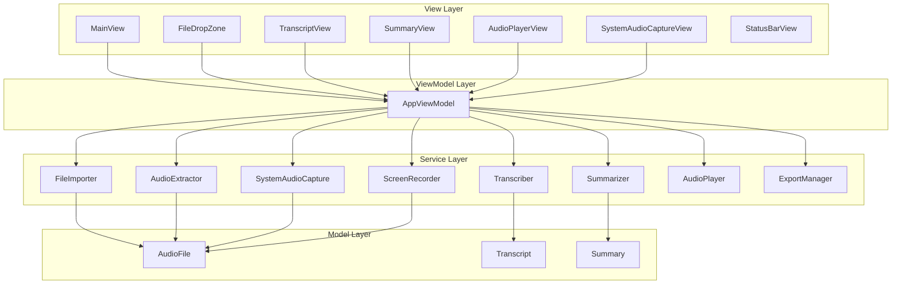
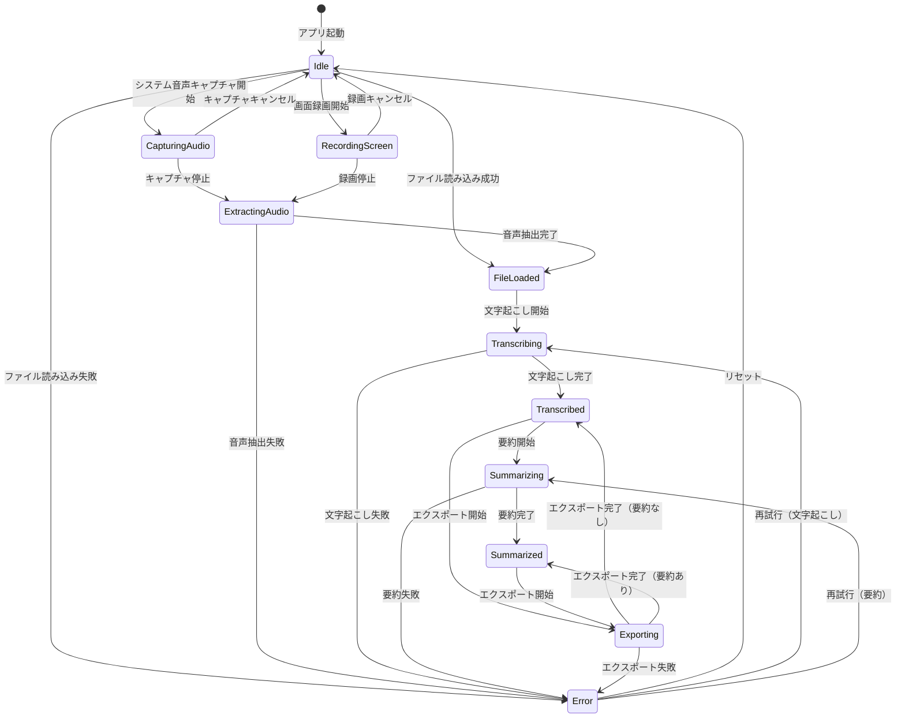

# 技術設計ドキュメント（Design Document）

## 概要（Overview）

本ドキュメントは、macOS 向け音声文字起こし・要約アプリケーションの技術設計を定義する。本アプリケーションは SwiftUI を用いた macOS ネイティブアプリケーションとして構築し、Apple の Speech フレームワーク（SFSpeechRecognizer）による音声認識と、ローカル LLM またはオンライン API による要約機能を提供する。また、ScreenCaptureKit によるシステム音声キャプチャ・画面録画、および動画ファイルからの音声抽出にも対応する。

### 主要な技術選定と根拠

| 技術 | 選定理由 |
|------|----------|
| SwiftUI | macOS ネイティブ UI フレームワーク。ダークモード/ライトモード対応が容易 |
| SFSpeechRecognizer | Apple 標準の音声認識 API。日本語・英語対応。オフライン利用可能 |
| AVFoundation | 音声・動画ファイルの読み込み・再生・メタデータ取得・音声抽出に使用 |
| ScreenCaptureKit | macOS 13+ のシステム音声キャプチャ・画面録画 API |
| NaturalLanguage | テキスト要約の前処理（文分割、キーワード抽出）に使用 |
| Swift Concurrency (async/await) | 非同期処理の管理。文字起こし・要約の並行処理に使用 |

## アーキテクチャ（Architecture）

本アプリケーションは MVVM（Model-View-ViewModel）アーキテクチャを採用する。各レイヤーの責務を明確に分離し、テスタビリティと保守性を確保する。



### レイヤー構成

- **View Layer**: SwiftUI ビュー。ユーザー操作の受付と表示を担当
- **ViewModel Layer**: ビジネスロジックの調整。View と Service の橋渡し
- **Service Layer**: 各機能の実装（ファイル読み込み、音声抽出、システム音声キャプチャ、画面録画、文字起こし、要約、再生、エクスポート）
- **Model Layer**: データモデルの定義


## コンポーネントとインターフェース（Components and Interfaces）

### FileImporter

音声・動画ファイルの読み込みとバリデーションを担当するサービス。

```swift
protocol FileImporting {
    /// サポートされるメディアファイル形式
    static var supportedExtensions: Set<String> { get }

    /// メディアファイルを読み込み、AudioFile モデルを返す
    func importFile(from url: URL) async throws -> AudioFile

    /// ファイル形式がサポート対象かを判定する
    func isSupported(fileExtension: String) -> Bool
}
```

**サポート形式**: m4a, wav, mp3, aiff, mp4, mov, m4v

**バリデーション処理フロー**:
1. ファイル拡張子の確認（サポート対象形式か）
2. ファイルの読み込み可否確認（破損チェック）
3. AVAsset を用いたメタデータ（再生時間）の取得
4. AudioFile モデルの生成
5. 動画ファイルの場合は AudioExtractor で音声トラックを自動抽出

### AudioExtractor

動画ファイルから音声トラックを抽出するサービス。

```swift
/// 動画ファイルから音声を抽出し、m4a ファイルとして保存する
final class AudioExtractor: Sendable {
    func extractAudio(from videoFile: AudioFile) async throws -> AudioFile
}
```

**処理フロー**:
1. AVAsset で動画の音声トラックの存在を確認
2. AVAssetExportSession で音声のみを m4a 形式でエクスポート
3. 抽出された音声ファイルの AudioFile モデルを生成

### SystemAudioCapture

PC のシステム音声（内部オーディオ）やマイク音声をキャプチャするサービス。音源種別に応じて ScreenCaptureKit または AVCaptureSession を使い分ける。

```swift
/// システム音声・マイク音声をキャプチャする
final class SystemAudioCapture: NSObject, @unchecked Sendable {
    func startCapture(sourceType: AudioSourceType) async throws
    func stopCapture() async throws -> AudioFile
    func cancelCapture() async
    var isCapturing: Bool { get }
    weak var delegate: SystemAudioCaptureDelegate? { get set }
}
```

**処理フロー**:
1. 音源種別に応じて録音方式を分岐:
   - システム全体 / 特定アプリ: SCShareableContent でディスプレイ情報を取得し、SCStream で音声キャプチャ
   - マイク: AVCaptureSession + AVCaptureDeviceInput で音声キャプチャ
2. AVAssetWriter で直接 M4A（AAC 128kbps, 48kHz, 2ch）に書き出し（MOV 経由の変換を廃止）
3. 停止時にファイルを最終保存先に移動し AudioFile モデルを生成して返却

### ScreenRecorder

画面録画（映像+音声）を行うサービス。

```swift
/// ScreenCaptureKit を使用して画面録画を行う
final class ScreenRecorder: NSObject {
    func startRecording() async throws
    func stopRecording() async throws -> AudioFile
    func cancelRecording() async
    var isRecording: Bool { get }
    weak var delegate: ScreenRecorderDelegate? { get set }
}
```

**処理フロー**:
1. SCShareableContent でディスプレイ情報を取得
2. SCStream で画面と音声を同時キャプチャ（30fps, H.264）
3. AVAssetWriter で MOV ファイルに書き込み
4. 停止時に AudioExtractor で音声を抽出し AudioFile モデルを返却

### Transcriber

音声認識による文字起こしを担当するサービス。

```swift
protocol Transcribing {
    /// 音声ファイルの文字起こしを実行する
    func transcribe(audioFile: AudioFile, language: TranscriptionLanguage,
                    onProgress: @escaping (Double) -> Void) async throws -> Transcript

    /// 文字起こし処理をキャンセルする
    func cancel()
}

enum TranscriptionLanguage: String {
    case japanese = "ja-JP"
    case english = "en-US"
}
```

**処理フロー**:
1. SFSpeechRecognizer の初期化（指定言語）
2. SFSpeechURLRecognitionRequest の作成
3. 認識タスクの開始と進捗コールバック
4. 認識結果の Transcript モデルへの変換
5. 無音検出時の専用メッセージ返却

### Summarizer

文字起こしテキストの要約を担当するサービス。

```swift
protocol Summarizing {
    /// Transcript の要約を生成する
    func summarize(transcript: Transcript) async throws -> Summary

    /// 要約可能な最小文字数
    static var minimumCharacterCount: Int { get } // 50
}
```

**処理フロー**:
1. Transcript の文字数チェック（50文字未満は拒否）
2. テキストの前処理（文分割）
3. 要約処理の実行
4. Summary モデルの生成

### AudioPlayer

音声ファイルの再生を担当するサービス。

```swift
protocol AudioPlaying {
    var isPlaying: Bool { get }
    var currentTime: TimeInterval { get }
    var duration: TimeInterval { get }

    /// 音声ファイルを読み込む
    func load(audioFile: AudioFile) throws

    /// 再生を開始する
    func play()

    /// 再生を一時停止する
    func pause()

    /// 指定位置にシークする
    func seek(to time: TimeInterval)
}
```

### ExportManager

文字起こし結果と要約のエクスポートを担当するサービス。

```swift
protocol Exporting {
    /// Transcript と Summary をテキストファイルとして保存する
    func export(transcript: Transcript, summary: Summary?,
                to directory: URL) async throws -> URL

    /// 指定ディレクトリへの書き込み権限を確認する
    func canWrite(to directory: URL) -> Bool
}
```

**エクスポートファイル命名規則**:
- 録音ファイル: `日付_時刻.m4a`（例: `20260403_151508.m4a`）
- 文字起こし結果: `元ファイル名.transcript.txt`（例: `20260403_151508.transcript.txt`）
- 要約結果: `元ファイル名.summary.txt`（例: `20260403_151508.summary.txt`）
- エラーログ: `日付_時刻.error.log`（エラー発生時のみ、1セッション1ファイル）

### StatusBarView

CPU・メモリ使用状況をリアルタイム表示するステータスバー。Darwin フレームワークを使用してシステムリソース情報を取得し、メインウィンドウ下部に表示する。

### AppViewModel

View と Service を接続する ViewModel。

```swift
@MainActor
class AppViewModel: ObservableObject {
    @Published var audioFile: AudioFile?
    @Published var transcript: Transcript?
    @Published var summary: Summary?
    @Published var transcriptionProgress: Double = 0
    @Published var isSummarizing: Bool = false
    @Published var isExtractingAudio: Bool = false
    @Published var isCapturingSystemAudio: Bool = false
    @Published var isRecordingScreen: Bool = false
    @Published var captureAudioLevel: Float = 0
    @Published var errorMessage: String?
    @Published var isPlaying: Bool = false
    @Published var playbackPosition: TimeInterval = 0
    @Published var selectedAudioSource: AudioSourceType = .systemAudio
    @Published var availableAudioSources: [AudioSourceType] = [.systemAudio]

    func importFile(from url: URL) async
    func startTranscription(language: TranscriptionLanguage) async
    func startSummarization() async
    func transcribeAndSummarize(language: TranscriptionLanguage) async
    func exportResults(to directory: URL) async
    func togglePlayback()
    func seek(to time: TimeInterval)
    func refreshAudioSources() async
    func startSystemAudioCapture() async
    func stopSystemAudioCapture() async
    func cancelSystemAudioCapture() async
    func startScreenRecording() async
    func stopScreenRecording() async
    func cancelScreenRecording() async
}
```


## データモデル（Data Models）

### AudioSourceType

```swift
/// 録音時に選択可能な音源の種別
enum AudioSourceType: Hashable, Identifiable {
    case systemAudio
    case microphone(deviceID: String, name: String)
    case application(bundleID: String, name: String)
}
```

### AudioSourceProvider

```swift
/// 利用可能な音源リソースの一覧を取得する
enum AudioSourceProvider {
    static func availableSources() async -> [AudioSourceType]
}
```

**取得方法**:
1. システム全体（常に利用可能）
2. マイクデバイス一覧（`AVCaptureDevice.DiscoverySession` で `builtInMicrophone` + `externalUnknown`）
3. 実行中アプリケーション一覧（`SCShareableContent.applications` から重複排除）

### AudioFile

```swift
struct AudioFile: Equatable {
    let id: UUID
    let url: URL
    let fileName: String
    let fileExtension: String
    let duration: TimeInterval
    let fileSize: Int64
    let createdAt: Date
}
```

### Transcript

```swift
struct Transcript: Equatable {
    let id: UUID
    let audioFileId: UUID
    let text: String
    let language: TranscriptionLanguage
    let createdAt: Date

    /// テキストが空かどうか
    var isEmpty: Bool { text.trimmingCharacters(in: .whitespacesAndNewlines).isEmpty }

    /// 文字数
    var characterCount: Int { text.count }
}
```

### Summary

```swift
struct Summary: Equatable {
    let id: UUID
    let transcriptId: UUID
    let text: String
    let createdAt: Date
}
```

### AppError

```swift
enum AppError: LocalizedError {
    case unsupportedFormat(String, supportedFormats: [String])
    case corruptedFile
    case transcriptionFailed(underlying: Error)
    case silentAudio
    case summarizationFailed(underlying: Error)
    case insufficientContent(minimumCharacters: Int)
    case exportFailed(underlying: Error)
    case writePermissionDenied(path: String)

    var errorDescription: String? {
        switch self {
        case .unsupportedFormat(let ext, let supported):
            return "「.\(ext)」形式はサポートされていません。対応形式: \(supported.joined(separator: ", "))"
        case .corruptedFile:
            return "ファイルが読み込めません"
        case .transcriptionFailed(let error):
            return "文字起こしに失敗しました: \(error.localizedDescription)"
        case .silentAudio:
            return "音声が検出されませんでした"
        case .summarizationFailed(let error):
            return "要約に失敗しました: \(error.localizedDescription)"
        case .insufficientContent(let min):
            return "要約するには内容が不十分です（最低\(min)文字必要）"
        case .exportFailed(let error):
            return "エクスポートに失敗しました: \(error.localizedDescription)"
        case .writePermissionDenied:
            return "保存先に書き込みできません。別のフォルダを選択してください"
        }
    }
}
```

### 状態遷移図（State Diagram）




## 正当性プロパティ（Correctness Properties）

*プロパティとは、システムのすべての有効な実行において成り立つべき特性や振る舞いのことである。人間が読める仕様と、機械的に検証可能な正当性保証の橋渡しとなる形式的な記述である。*

### Property 1: ファイル形式の判定整合性（File Format Validation Consistency）

*任意の*ファイル拡張子に対して、その拡張子がサポート対象（m4a, wav, mp3, aiff, mp4, mov, m4v）であれば `isSupported` が true を返し、サポート対象外であれば false を返す。さらに、サポート対象外の拡張子でインポートを試みた場合、エラーメッセージにすべてのサポート対象形式が含まれる。

**Validates: Requirements 1.3, 1.4**

### Property 2: 読み込み後のメタデータ保持（Metadata Preservation After Import）

*任意の*有効な音声ファイルに対して、FileImporter で読み込んだ後の AudioFile モデルは、元のファイルのファイル名、ファイル形式（拡張子）、および正の再生時間を保持する。

**Validates: Requirements 1.5**

### Property 3: 短いテキストの要約拒否（Short Text Summarization Rejection）

*任意の* 50文字未満の文字列に対して、Summarizer はその文字列を要約せず、insufficientContent エラーを返す。

**Validates: Requirements 3.5**

### Property 4: 要約のキーワード保持（Summary Keyword Retention）

*任意の*十分な長さ（50文字以上）の Transcript に対して、生成された Summary は元の Transcript に含まれる主要な単語（名詞・固有名詞）の少なくとも一部を含む。

**Validates: Requirements 3.4**

### Property 5: エクスポートのラウンドトリップ（Export Round Trip）

*任意の* Transcript と Summary の組み合わせに対して、ExportManager でファイルに書き出した後、そのファイルを読み込むと、元の Transcript テキストと Summary テキストが含まれている。

**Validates: Requirements 4.1**

### Property 6: シーク位置の正確性（Seek Position Accuracy）

*任意の*有効な再生位置（0 以上かつ duration 以下）に対して、AudioPlayer で seek を実行した後の currentTime は指定した位置と一致する（許容誤差内）。

**Validates: Requirements 5.4**

### Property 7: 動画からの音声抽出整合性（Video Audio Extraction Consistency）

*任意の*音声トラックを含む動画ファイルに対して、AudioExtractor で音声を抽出した後の AudioFile は、正の再生時間を持つ m4a 形式のファイルである。

**Validates: Requirements 1.7**


## エラーハンドリング（Error Handling）

### 折りたたみセクション自動開閉連動

各操作に応じて、折りたたみ可能なセクション（入力、リアルタイム文字起こし、音声文字起こし、要約）の展開/折りたたみ状態を自動制御する。

| 操作 | 入力 | リアルタイム | 音声文字起こし | 要約 |
|------|------|------------|--------------|------|
| 録音/録画開始 | 展開 | 展開 | 折りたたみ | 折りたたみ |
| 録音/録画停止 | - | - | 展開 | 展開 |
| FileDropZone ファイル選択 | 折りたたみ | 折りたたみ | - | - |
| ファイルから要約 | 折りたたみ | 折りたたみ | - | - |

**実装方式（macOS）**: FileDropZone に `onFileSelected` コールバックを追加し、MainView の `@State` を制御する。録音開始/停止は `handleCaptureChange` メソッドで制御する。

**実装方式（Windows）**: MainPage.xaml の各 Expander に `x:Name` を付与し、コードビハインドで `IsExpanded` プロパティを直接制御する。

### エラー処理方針

本アプリケーションでは、すべてのエラーを `AppError` 列挙型で統一的に管理する。各サービスは Swift の `throws` メカニズムを用いてエラーを伝播し、ViewModel がエラーをキャッチしてユーザー向けメッセージに変換する。

### エラー分類と対応

| エラー種別 | 発生箇所 | ユーザー向け対応 |
|-----------|---------|----------------|
| `unsupportedFormat` | FileImporter | 対応形式一覧を含むエラーメッセージ表示 |
| `corruptedFile` | FileImporter | 「ファイルが読み込めません」メッセージ表示 |
| `transcriptionFailed` | Transcriber | エラー内容表示 + 再試行ボタン |
| `silentAudio` | Transcriber | 「音声が検出されませんでした」メッセージ表示 |
| `summarizationFailed` | Summarizer | エラー内容表示 + 再試行ボタン |
| `insufficientContent` | Summarizer | 「要約するには内容が不十分です」メッセージ表示 |
| `exportFailed` | ExportManager | エラー内容表示 |
| `writePermissionDenied` | ExportManager | 「保存先に書き込みできません」メッセージ表示 |

### 再試行メカニズム

文字起こし（Transcription）と要約（Summarization）の処理でエラーが発生した場合、ユーザーに再試行ボタンを提供する。再試行時は同じパラメータで処理を再実行する。ViewModel は最後に実行した操作のコンテキストを保持し、再試行を可能にする。

### エラー表示

エラーメッセージは SwiftUI の `.alert` モディファイアを用いてモーダルダイアログとして表示する。再試行可能なエラーの場合は「再試行」と「閉じる」の2つのアクションを提供する。

## テスト戦略（Testing Strategy）

### テスト方針

本アプリケーションでは、ユニットテストとプロパティベーステストの2つのアプローチを併用し、包括的なテストカバレッジを実現する。

- **ユニットテスト**: 具体的な入出力例、エッジケース、エラー条件の検証
- **プロパティベーステスト**: すべての入力に対して成り立つべき普遍的なプロパティの検証

両者は補完的であり、ユニットテストが具体的なバグを検出し、プロパティベーステストが一般的な正当性を保証する。

### プロパティベーステスト設定

- **ライブラリ**: [SwiftCheck](https://github.com/typelift/SwiftCheck)
- **各テストの最小実行回数**: 100回
- **タグ形式**: 各テストにコメントで設計ドキュメントのプロパティを参照する
  - 形式: `// Feature: audio-transcription-summary, Property {番号}: {プロパティ名}`
- **各正当性プロパティは単一のプロパティベーステストで実装する**

### ユニットテスト計画

| テスト対象 | テスト内容 | 対応要件 |
|-----------|-----------|---------|
| FileImporter | サポート対象形式（音声+動画）のファイル読み込み成功 | 1.1, 1.2, 1.3 |
| FileImporter | 破損ファイルのエラーハンドリング | 1.6 |
| AudioExtractor | 動画からの音声抽出成功 | 1.7 |
| AudioExtractor | 音声トラックなし動画のエラー | 1.8 |
| Transcriber | 日本語音声の文字起こし | 2.4 |
| Transcriber | 英語音声の文字起こし | 2.5 |
| Transcriber | 無音ファイルの検出 | 2.7 |
| Transcriber | エラー発生時の再試行 | 2.6 |
| Summarizer | 正常な要約生成 | 3.1 |
| Summarizer | エラー発生時の再試行 | 3.6 |
| ExportManager | 書き込み権限なしのエラー | 4.4 |
| AudioPlayer | 再生/一時停止の状態遷移 | 5.1, 5.3 |
| SystemAudioCapture | キャプチャ開始・停止 | 7.2, 7.5 |
| ScreenRecorder | 録画開始・停止 | 8.2, 8.4 |
| AppViewModel | 起動時の初期状態 | 6.4 |

### プロパティベーステスト計画

| プロパティ | テスト内容 | ジェネレータ |
|-----------|-----------|------------|
| Property 1 | ファイル形式の判定整合性 | ランダムなファイル拡張子文字列 |
| Property 2 | 読み込み後のメタデータ保持 | 有効な音声ファイルURL（モック） |
| Property 3 | 短いテキストの要約拒否 | 0〜49文字のランダム文字列 |
| Property 4 | 要約のキーワード保持 | 50文字以上のランダムテキスト |
| Property 5 | エクスポートのラウンドトリップ | ランダムな Transcript/Summary テキスト |
| Property 6 | シーク位置の正確性 | 0〜duration 範囲のランダムな TimeInterval |
| Property 7 | 動画からの音声抽出整合性 | 音声トラック付き動画ファイル（モック） |

