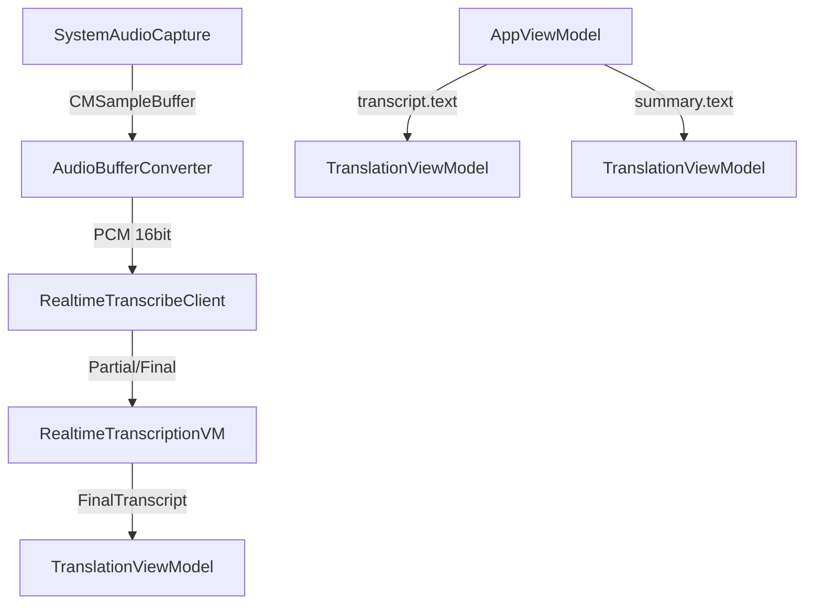

# 技術設計ドキュメント（Design Document）

## 概要

Amazon Transcribe Streaming によるリアルタイム文字起こし、Amazon Translate によるリアルタイム翻訳、バッチ文字起こし・要約の翻訳機能を提供する。macOS（SwiftUI）と Windows（WinUI 3）で共通の UI レイアウトを採用する。

## アーキテクチャ

## 新規コンポーネント

### TranslationViewModel（翻訳パネル用 ViewModel）
- 各セクション（リアルタイム・文字起こし・要約）で独立したインスタンスを使用
- translate() / changeLanguageAndTranslate() / translateAppend() / reset()

### TranslationPanel（翻訳パネル View）
- 言語 Picker + 翻訳ボタン + CopyableTextView
- autoTranslate モード（リアルタイム用）と手動翻訳モード

### CopyableTextView（コピーボタン付きテキスト表示）
- テキスト表示 + コピーボタン（「コピー」→「コピー済み」フィードバック）
- 全テキストエリアで共通使用

## UI レイアウト

上下分割。上部: 入力（録音→ファイル→プレーヤー縦並び）。下部: 3つの折りたたみ可能セクション。各セクションは左右2列（元テキスト | 翻訳）。

詳細は `docs/ui-layout-spec.md` を参照。

## 録音開始時の初期化

録音/録画開始時に以下をクリア:
- realtimeVM: finalText, partialText, detectedLanguage, errorMessage
- realtimeTranslationVM, transcriptTranslationVM, summaryTranslationVM: reset()
- viewModel: transcript = nil, summary = nil
