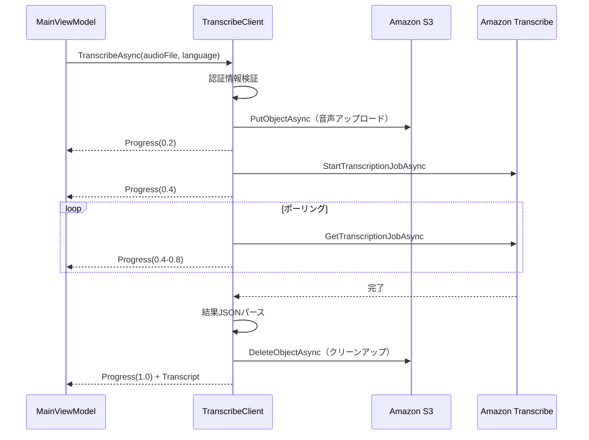

# 技術設計ドキュメント（Design Document）- Windows版 Amazon Transcribe連携

## 概要

AWS SDK for .NET（AWSSDK.TranscribeService, AWSSDK.S3）を使用してAmazon Transcribeバッチ文字起こしを実装する。設定はJSON永続化、S3経由でTranscribeにファイルを渡す。

### 技術選定

| 技術 | 選定理由 |
|------|----------|
| AWSSDK.TranscribeService 4.* | Amazon Transcribe公式.NET SDK v4 |
| AWSSDK.S3 4.* | S3アップロード/削除 |
| System.Text.Json | 設定JSON永続化 |

## アーキテクチャ



## コンポーネント

### TranscribeClient

```csharp
public class TranscribeClient
{
    private readonly SettingsStore _settingsStore;

    public async Task<Transcript> TranscribeAsync(
        AudioFile audioFile,
        string language,
        IProgress<double> progress,
        CancellationToken ct = default);
}
```

処理フロー:
1. `_settingsStore.Load()` で認証情報取得・検証 (progress 0.1)
2. `AmazonS3Client.PutObjectAsync` でS3アップロード (progress 0.2)
3. `AmazonTranscribeServiceClient.StartTranscriptionJobAsync` (progress 0.4)
4. 3秒間隔で `GetTranscriptionJobAsync` ポーリング (progress 0.4-0.8)
5. 結果URI取得→JSONパース→Transcript生成 (progress 0.9)
6. `DeleteObjectAsync` でS3クリーンアップ (progress 1.0)

### SettingsDialog (ContentDialog)

```csharp
// ContentDialogベースの設定画面（MinWidth=750）
// グループラベル: 青色バッジ（🔑 AWS認証情報、📁 フォルダ設定、🎙️ リアルタイム設定、🔍 要約（Bedrock））
// - TextBox: Access Key ID
// - PasswordBox: Secret Access Key
// - ComboBox: リージョン（12リージョン）
// - TextBox: S3バケット名
// - FolderPicker: 録音保存先、エクスポート保存先（「📁 フォルダを選択...」ボタンを別行に配置）
// - ToggleSwitch: リアルタイム文字起こし、言語自動判別
// - ComboBox: デフォルト翻訳先言語
// - 🔍 要約（Bedrock）グループ: ComboBox で基盤モデル選択（リージョン変更時に自動更新）
// - Button: 保存、接続テスト、削除
// - 接続ステータスバッジ（灰/黄/緑/赤）
```

### 接続テスト

```csharp
public async Task<bool> TestConnectionAsync()
{
    // 1. S3にテストオブジェクト書き込み
    // 2. テストオブジェクト削除
    // 3. 成功→true、失敗→例外メッセージ
}
```

接続テストフロー:
1. テストボタン押下 → ProgressRing表示、ボタン無効化
2. 入力中の認証情報で一時的にSettingsStoreに保存
3. TranscribeClient.TestConnectionAsync() 呼び出し（S3テストオブジェクト書き込み→削除）
4. 成功: 緑バッジ「接続成功」、失敗: 赤バッジ + エラーメッセージ
5. ProgressRing停止、ボタン有効化
6. 元の設定を復元
```

## エラーハンドリング

| エラー条件 | AppErrorType | メッセージ |
|-----------|-------------|----------|
| 認証情報未設定 | CredentialsNotSet | AWS認証情報が設定されていません |
| 認証情報無効 | TranscriptionFailed | AWS認証情報が無効です |
| ネットワーク不通 | TranscriptionFailed | ネットワーク接続を確認してください |
| S3アクセス拒否 | TranscriptionFailed | IAMポリシーを確認してください |
| ジョブ失敗 | TranscriptionFailed | ジョブ失敗理由を含む |
| 無音 | SilentAudio | 音声が検出されませんでした |

## Summarizer（Bedrock要約）

```csharp
public class Summarizer
{
    public async Task<Summary> SummarizeAsync(Transcript transcript, string additionalPrompt = "")
    {
        // Cross-Region inference profile IDを使用（on-demand throughput対応）
        var model = BedrockModel.Find(modelId);
        var inferenceId = model?.GetInferenceId(settings.Region) ?? modelId;
        // ConverseRequest.ModelId = inferenceId
    }
}
```

Bedrock要約失敗時はErrorLoggerにログを記録し、ローカル抽出型要約にフォールバックする。

## ErrorLogger統合

TranscribeClient、Summarizer、MainViewModelの各エラーハンドリング箇所でErrorLogger.SaveErrorLogを呼び出し、詳細なエラー情報をファイルに記録する。

## テスト戦略

- TranscribeClientのAWS依存をインターフェースで抽象化
- IS3Client, ITranscribeServiceClientプロトコルでモック化
- xUnit + FsCheck
