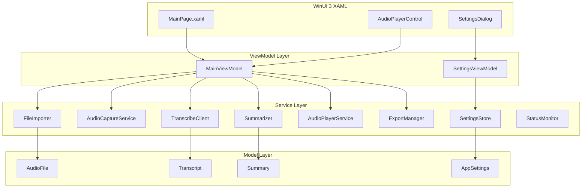
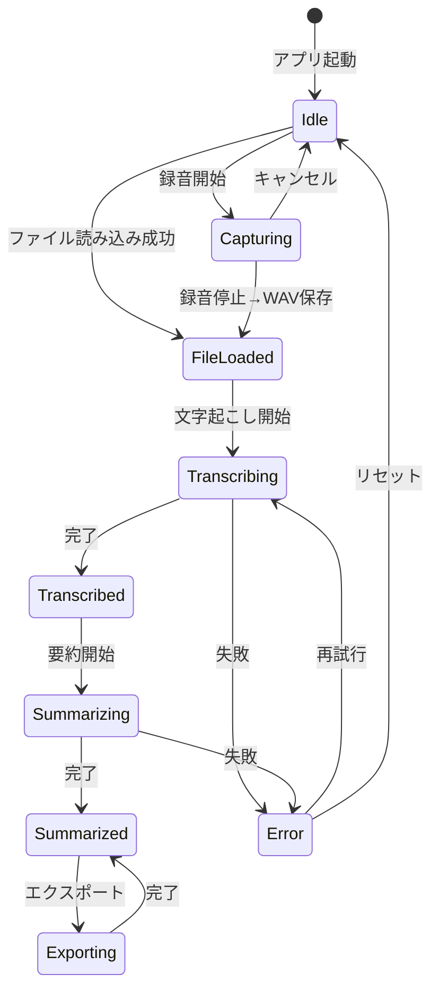

# 技術設計ドキュメント（Design Document）- Windows版

## 概要（Overview）

Windows向け音声文字起こし・要約アプリケーション（WinUI 3 / .NET 8）の技術設計。NAudioによる音声キャプチャ・再生、Amazon Transcribeによる文字起こし、抽出型要約、ファイルインポート・エクスポート機能を提供する。

### 主要な技術選定と根拠

| 技術 | 選定理由 |
|------|----------|
| WinUI 3 (Windows App SDK) | Windows ネイティブ UI。ダークモード/ライトモード自動対応 |
| .NET 8 | 最新LTS。Windows 10 19041+サポート |
| NAudio | Windows音声キャプチャ・再生の定番ライブラリ。WasapiLoopbackCapture対応 |
| CommunityToolkit.Mvvm | MVVM パターン。ObservableObject、RelayCommand |
| AWS SDK for .NET v4 | Amazon Transcribe / S3 / Translate の公式SDK（AWSSDK.TranscribeService 4.*, AWSSDK.S3 4.*, AWSSDK.Translate 4.*, AWSSDK.TranscribeStreaming 4.*） |
| System.Text.Json | 設定ファイルのJSON永続化 |

## アーキテクチャ（Architecture）

MVVM アーキテクチャを採用。



## コンポーネントとインターフェース

### SettingsStore

```csharp
public class SettingsStore
{
    private static readonly string SettingsPath =
        Path.Combine(Environment.GetFolderPath(
            Environment.SpecialFolder.ApplicationData),
            "AudioTranscriptionSummary", "settings.json");

    public AppSettings Load();
    public void Save(AppSettings settings);
}
```

### AudioCaptureService

```csharp
public class AudioCaptureService : IDisposable
{
    public List<AudioSourceInfo> EnumerateDevices();
    public void StartCapture(AudioSourceInfo source);
    public string StopCapture();  // returns WAV file path (saved to RecordingDirectoryPath from SettingsStore)
    public void CancelCapture();
    public bool IsCapturing { get; }
    public float AudioLevel { get; }  // 0.0-1.0
    public WaveFormat? CaptureWaveFormat { get; }  // for realtime streaming conversion
    public event EventHandler<float> AudioLevelChanged;
    public event EventHandler<byte[]> DataAvailable;  // for realtime streaming
}
```

録音ファイルの保存先はSettingsStoreのRecordingDirectoryPathを使用する。

public class AudioSourceInfo
{
    public string Id { get; init; }
    public string Name { get; init; }
    public bool IsLoopback { get; init; }  // true=system audio, false=mic
}
```

### FileImporter

```csharp
public class FileImporter
{
    public static readonly HashSet<string> SupportedExtensions =
        new() { ".m4a", ".wav", ".mp3", ".aiff", ".mp4", ".mov", ".m4v" };

    public AudioFile Import(string filePath);
    public bool IsSupported(string extension);
}
```

### AudioPlayerService

```csharp
public class AudioPlayerService : IDisposable
{
    public void Load(string filePath);
    public void Play();
    public void Pause();
    public void Seek(TimeSpan position);
    public bool IsPlaying { get; }
    public TimeSpan CurrentTime { get; }
    public TimeSpan Duration { get; }
    public event EventHandler<TimeSpan> PositionChanged;
}
```

内部実装: NAudio `WaveOutEvent` + `AudioFileReader`。100ms間隔の`DispatcherTimer`で位置更新。

### Summarizer

```csharp
public class Summarizer
{
    public const int MinimumCharacterCount = 50;

    public Summary Summarize(Transcript transcript);
}
```

処理フロー:
1. 文分割（。！？.!? で分割）
2. 単語頻度スコアリング（最大値で正規化）
3. 位置スコアリング（先頭1.0、末尾0.5、中間漸減）
4. 長さスコアリング
5. 上位約30%（最低1文）を選択、元の順序を保持

### ExportManager

```csharp
public class ExportManager
{
    public void Export(Transcript transcript, Summary? summary, string directory);
    public bool CanWrite(string directory);
}
```

ファイル形式:
- `{baseName}.transcript.txt`: "=== Transcript ===" + テキスト
- `{baseName}.summary.txt`: "=== Summary ===" + テキスト
- UTF-8エンコーディング

### StatusMonitor

```csharp
public class StatusMonitor
{
    public double AppCpuPercent { get; }
    public double SystemCpuPercent { get; }
    public long AppMemoryBytes { get; }
    public long TotalMemoryBytes { get; }
    public void Update();
}
```

内部実装: `System.Diagnostics.Process.GetCurrentProcess()` でアプリCPU/メモリ、`GC.GetGCMemoryInfo()` と `PerformanceCounter` でシステム全体。

表示形式: 全幅Grid（背景色 #E0E0E0、テキスト色 #808080）に右寄せで「CPU: アプリX% / 全体X%    メモリ: X MB / X GB (X%)」を表示。

### MainViewModel

```csharp
public partial class MainViewModel : ObservableObject
{
    [ObservableProperty] private AudioFile? _audioFile;
    [ObservableProperty] private Transcript? _transcript;
    [ObservableProperty] private Summary? _summary;
    [ObservableProperty] private double _transcriptionProgress;
    [ObservableProperty] private bool _isCapturing;
    [ObservableProperty] private bool _isSummarizing;
    [ObservableProperty] private float _audioLevel;
    [ObservableProperty] private string? _errorMessage;
    [ObservableProperty] private bool _isPlaying;
    [ObservableProperty] private TimeSpan _playbackPosition;
    [ObservableProperty] private List<AudioSourceInfo> _audioSources;
    [ObservableProperty] private AudioSourceInfo? _selectedSource;

    [RelayCommand] private async Task ImportFileAsync();
    [RelayCommand] private async Task TranscribeAndSummarizeAsync();
    [RelayCommand] private async Task ExportAsync();
    [RelayCommand] private async Task StartCaptureAsync();
    [RelayCommand] private void StopCapture();
    [RelayCommand] private void CancelCapture();
    [RelayCommand] private void TogglePlayback();
    [RelayCommand] private void Seek(double position);

    // Realtime & Translation ViewModels
    public RealtimeTranscriptionViewModel RealtimeTranscriptionVM { get; }
    public TranslationViewModel RealtimeTranslationVM { get; }
    public TranslationViewModel TranscriptTranslationVM { get; }
    public TranslationViewModel SummaryTranslationVM { get; }
}
```

## データモデル（Data Models）

### AppSettings

```csharp
public class AppSettings
{
    public string AccessKeyId { get; set; } = "";
    public string SecretAccessKey { get; set; } = "";
    public string Region { get; set; } = "ap-northeast-1";
    public string S3BucketName { get; set; } = "";
    public string RecordingDirectoryPath { get; set; } = "";
    public string ExportDirectoryPath { get; set; } = "";
    public bool IsRealtimeEnabled { get; set; } = true;
    public bool IsAutoDetectEnabled { get; set; } = true;
    public string DefaultTargetLanguage { get; set; } = "ja";
}
```

### AudioFile

```csharp
public record AudioFile(
    Guid Id,
    string FilePath,
    string FileName,
    string Extension,
    TimeSpan Duration,
    long FileSize,
    DateTime CreatedAt
);
```

### Transcript

```csharp
public record Transcript(
    Guid Id,
    Guid AudioFileId,
    string Text,
    string Language,
    DateTime CreatedAt
);
```

### Summary

```csharp
public record Summary(
    Guid Id,
    Guid TranscriptId,
    string Text,
    DateTime CreatedAt
);
```

### AppError

```csharp
public enum AppErrorType
{
    UnsupportedFormat,
    CorruptedFile,
    TranscriptionFailed,
    SilentAudio,
    SummarizationFailed,
    InsufficientContent,
    ExportFailed,
    WritePermissionDenied,
    CredentialsNotSet
}

public class AppError : Exception
{
    public AppErrorType ErrorType { get; }
    public bool IsRetryable => ErrorType is
        AppErrorType.TranscriptionFailed or AppErrorType.SummarizationFailed;
}
```

## 状態遷移図

### 折りたたみセクション自動開閉連動

各操作に応じて、Expanderセクション（入力、リアルタイム文字起こし、音声文字起こし、要約）のIsExpandedプロパティを自動制御する。

| 操作 | 入力 | リアルタイム | 音声文字起こし | 要約 |
|------|------|------------|--------------|------|
| 録音開始 | 展開 | 展開 | 折りたたみ | 折りたたみ |
| 録音停止 | - | - | 展開 | 展開 |
| ファイルD&D/選択 | 折りたたみ | 折りたたみ | - | - |
| ファイルから要約 | 折りたたみ | 折りたたみ | - | - |

**実装方式**: MainPage.xamlの各Expanderに`x:Name`を付与（InputSection, RealtimeSection, TranscriptSection, SummarySection）し、コードビハインドで`IsExpanded`プロパティを直接制御する。`CollapseInputAndRealtime()`ヘルパーメソッドで入力+リアルタイムの折りたたみを共通化する。



## テスト戦略

- ユニットテスト: xUnit + Moq
- プロパティベーステスト: FsCheck
- AWS依存はインターフェース抽象化でモック化

## アプリアイコン

AppIconGenerator サービスが System.Drawing.Common を使用してプログラムでアイコンを生成する。macOS版と同じデザイン（青グラデーション背景 + 白い波形バー + ドキュメントアイコン + 「T」文字）をICOファイルとして出力し、%APPDATA%\AudioTranscriptionSummary\app.ico にキャッシュする。MainWindow の初期化時に AppWindow.SetIcon() でタイトルバーとタスクバーに設定する。

## インストーラー

Inno Setup 6 を使用したWindowsインストーラーを提供する。

- スクリプト: `windows/installer/setup.iss`
- ビルドスクリプト: `windows/installer/build-installer.ps1`
- 出力: `windows/installer/output/AudioTranscriptionSummary_Setup_1.0.0.exe`
- 日本語・英語対応、デスクトップアイコン作成オプション付き
