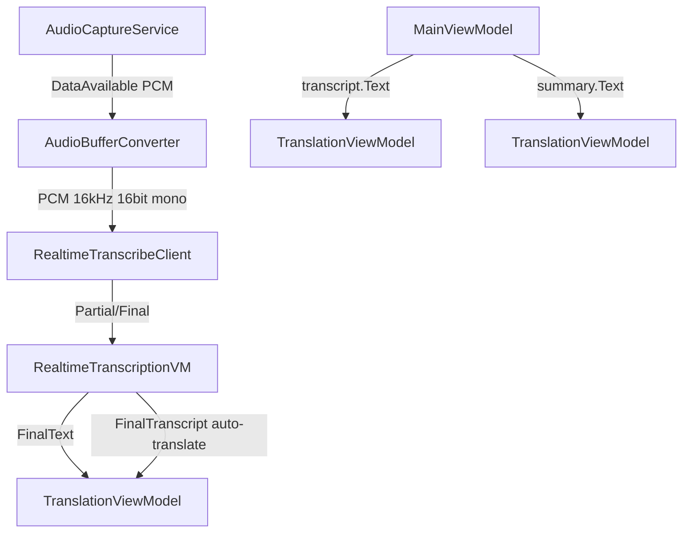

# 技術設計ドキュメント（Design Document）- Windows版 リアルタイム文字起こし・翻訳

## 概要

Amazon Transcribe Streaming APIによるリアルタイム文字起こし、Amazon Translateによる翻訳機能。NAudioのDataAvailableイベントから音声データをストリーミング送信する。AWS SDK v4（AWSSDK.TranscribeStreaming 4.*, AWSSDK.Translate 4.*）を使用。

## アーキテクチャ



## コンポーネント

### RealtimeTranscribeClient

```csharp
public class RealtimeTranscribeClient : IDisposable
{
    public async Task StartStreamingAsync(string language, bool autoDetect);
    public void SendAudioChunk(byte[] pcmData);
    public void StopStreaming();

    public event EventHandler<string> PartialTranscriptReceived;
    public event EventHandler<string> FinalTranscriptReceived;
    public event EventHandler<string> LanguageDetected;
    public event EventHandler<string> ErrorOccurred;
}
```

音声フォーマット: PCM 16kHz, 16-bit signed LE, mono

### AudioBufferConverter

```csharp
public static class AudioBufferConverter
{
    // NAudioのWaveFormat → PCM 16kHz 16bit monoに変換
    public static byte[] ConvertToPcm16kHz(byte[] input, WaveFormat sourceFormat);
}
```

### TranslationViewModel

```csharp
public partial class TranslationViewModel : ObservableObject
{
    [ObservableProperty] private string _translatedText = "";
    [ObservableProperty] private TranslationLanguage _selectedLanguage = TranslationLanguage.Japanese;
    [ObservableProperty] private bool _isTranslating;
    [ObservableProperty] private string? _errorMessage;

    [RelayCommand] private async Task TranslateAsync(string? sourceText);
    public void Reset();
}
```

### TranslateService

```csharp
public class TranslateService
{
    public async Task<string> TranslateTextAsync(
        string text, string targetLanguageCode, CancellationToken ct = default);
}
```

- ソース言語: "auto"
- 再試行: 指数バックオフ最大3回（1s, 2s, 4s）
- 空テキストはAPI呼び出しなしで空文字返却

### RealtimeTranscriptionViewModel

```csharp
public partial class RealtimeTranscriptionViewModel : ObservableObject
{
    [ObservableProperty] private string _finalText = "";
    [ObservableProperty] private string _partialText = "";
    [ObservableProperty] private string? _detectedLanguage;
    [ObservableProperty] private string? _errorMessage;

    public void AppendFinalTranscript(string text);
    public void UpdatePartialTranscript(string text);
    public Transcript? ToTranscript(Guid audioFileId);
    public void Reset();
}
```

注意: リアルタイム文字起こしの結果はRealtimeTranscriptionVM内にのみ保持される。MainViewModelのTranscriptフィールドはバッチ文字起こし（TranscribeAndSummarize）でのみ設定される。録音停止時にリアルタイム結果をTranscriptに代入しない。

## リアルタイム自動翻訳

FinalTranscript受信時に、FinalText全体の自動翻訳をトリガーする。MainViewModelのStartRealtimeStreamingAsyncで、FinalTranscriptReceivedイベントハンドラ内でRealtimeTranslationVM.TranslateCommand.ExecuteAsync(fullText)を呼び出す。

```csharp
_realtimeClient.FinalTranscriptReceived += (_, text) =>
{
    _dispatcherQueue.TryEnqueue(async () =>
    {
        RealtimeTranscriptionVM.AppendFinalTranscript(text);
        var fullText = RealtimeTranscriptionVM.FinalText;
        if (!string.IsNullOrWhiteSpace(fullText))
            await RealtimeTranslationVM.TranslateCommand.ExecuteAsync(fullText);
    });
};
```

## TranscriptionLanguage ComboBox

TranscriptionLangCombo（ComboBox）を「文字起こし＋要約」ボタンの横に配置。TranscriptionLanguage列挙型（21言語＋Auto）の表示名をItemsに追加。選択変更時にMainViewModel.SelectedTranscriptionLanguageを更新。Auto選択時はリアルタイム文字起こしでautoDetect=trueを使用。

## UIレイアウト

上下分割。下部に3つのExpanderセクション（各ヘッダーに色付き背景+FontIconアイコン）。各セクションは左右2列（元テキスト | 翻訳）。テキストエリアにはBorderフレーム（BorderThickness=1, CornerRadius=4）を適用。

```
┌─────────────────────────────────────────┐
│ CommandBar: 録音/停止 キャンセル 設定      │
├─────────────────────────────────────────┤
│ [Expander] 入力                          │
│   ComboBox(音源) ProgressBar(レベル)      │
├─────────────────────────────────────────┤
│ [Expander] リアルタイム文字起こし          │
│   左: プレビュー+コピー | 右: 翻訳+コピー  │
├─────────────────────────────────────────┤
│ [Expander] 音声文字起こし                 │
│   ドロップゾーン + AudioPlayer             │
│   左: 結果+ボタン+コピー | 右: 翻訳+コピー │
├─────────────────────────────────────────┤
│ [Expander] 要約                          │
│   左: 結果+コピー | 右: 翻訳+コピー       │
├─────────────────────────────────────────┤
│ [Grid] ステータスバー (背景#E0E0E0)       │
│                    CPU: アプリX% / 全体X% │
│                    メモリ: X MB / X GB    │
└─────────────────────────────────────────┘
```

## 録音開始時の初期化

録音開始時にクリア:
- RealtimeTranscriptionVM: FinalText, PartialText, DetectedLanguage, ErrorMessage
- 各TranslationVM: Reset()
- MainViewModel: Transcript=null, Summary=null, AudioFile=null

## テスト戦略

- xUnit + FsCheck
- RealtimeTranscribeClientのAWS依存をインターフェースで抽象化
- TranslateServiceの再試行ロジックをユニットテスト
